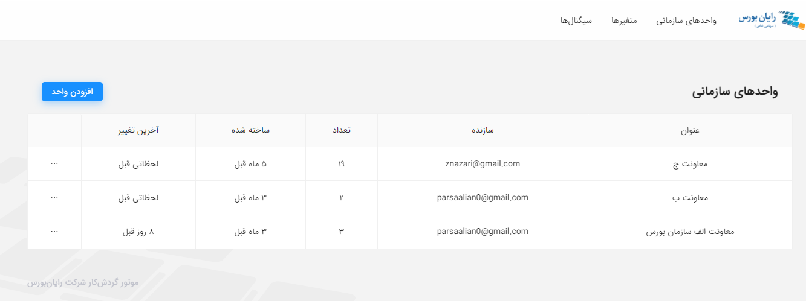
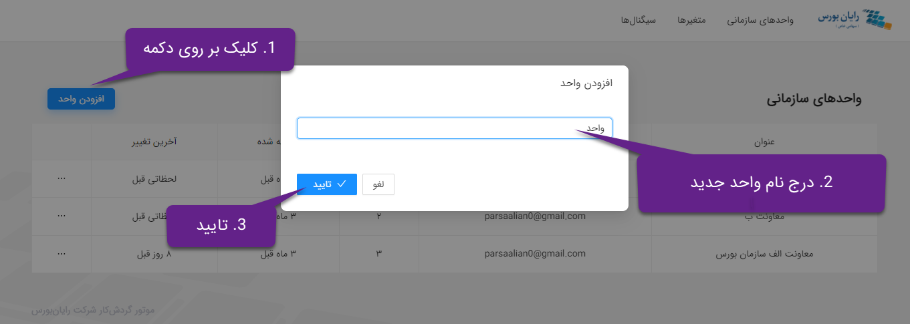
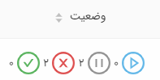

# واسط کاربری

در این فصل، بخش‌های مختلف و امکانات موجود در واسط کاربری موتور گردش‌کار به صورت یک‌به‌یک و در قالب بخش‌های مجزا معرفی می‌شود. تلاش شده است تا با کمک توضیحات متنی و ارائه تصویرهای مرتبط از عملکرد نمونه سامانه، خواننده به صورت گام‌به‌گام با امکانات مختلف سامانه آشنا شود. در بخش‌های بعد به معرفی هریک از صفحات و امکانات موتور گردش‌کار پرداخته شده است.

## واحد سازمانی

در این صفحه لیست واحدهای موجود نمایش داده می‌شود. به‌علاوه در این صفحه امکان افزودن واحد سازمانی، ویرایش و حذف واحد وجود دارد.

شکل 1: صفحه واحدهای سازمانی

### افزودن واحد سازمانی

در این صفحه با کلیک بر روی دکمه افزودن واحد، یک پاپ‌آپ ظاهر می‌شود که در آن می‌توان نام واحد جدید را درج کرد.

شکل 2: افزودن واحد سازمانی

### ویرایش واحد سازمانی

برای این کار باید در ستون آخر جدول روی سه‌نقطه کلیک کرده و در پاپ‌آپ ظاهرشده، ویرایش واحد را انتخاب نمایید. بعد از آن می‌توان در پاپ‌آپ ظاهر شده، نام واحد را تغییر داد.

شکل 3: ویرایش واحد سازمانی

### حذف واحد سازمانی

برای این کار باید در ستون آخر جدول بر روی سه‌نقطه کلیک کرده و در پاپ‌آپ ظاهر شده، حذف واحد را انتخاب نمایید.

شکل 4: حذف واحد سازمانی

## گردش کارها

در صفحه واحدهای سازمانی با انتخاب هر واحد، صفحه دیگری نمایش داده می‌شود که در آن لیست گردش‌کارهای موجود در آن واحد قرار دارد. در این صفحه می‌توان گردش‌کار را اضافه، ویرایش و حذف کرد. همچنین امکان بارگذاری فایل در این صفحه پیش‌بینی‌شده که از طریق آن می‌توان یک فایل bpmn را که قبلاً از همین سامانه استخراج شده است، به صورت یک گردش‌کار جدید به سامانه اضافه کرد.

شکل 5: لیست گردش‌کارهای هر واحد

### افزودن گردش‌کار

با کلیک کردن بر روی دکمه افزودن گردش‌کار، وارد صفحه دیگری می‌شوید که در آن صفحه با استفاده از مدل‌ساز موجود در صفحه، می‌توان گردش‌کار خود را طراحی کرد. در طراحی گردش‌کار بایستی هر مؤلفه از گردش‌کار، دارای نام باشد. در ‏فصل 2 با عنوان «راهنمای طراحی گردش کار»، به صورت مفصل به معرفی و توضیح جزییات و امکانات موجود در این صفحه و معنا و کاربرد عناصر قابل پشتیبانی از BPMN پرداخته شده‌است.

شکل 6: افزودن گردش‌کار

### مشاهده گردش‌کار

در این صفحه با انتخاب هر گردش‌کار می‌توان اطلاعات مربوط به گردش‌کار را مشاهده و ویرایش نمود. همچنین، با کلیک بر روی دیاگرام گردش‌کار، صفحه مدل‌ساز گردش‌کار ظاهر می‌شود که در آن امکان تغییر طراحی گردش‌کار فراهم است.

### حذف گردش کار

برای حذف گردش‌کار کافی است، در ستون آخر جدول روی سه‌نقطه کلیک کرده و سپس حذف را انتخاب نمایید.

شکل 7: حذف گردش کار

## صفحه‌ مدل‌ساز

در صفحه‌ی گردش‌کارها با انتخاب هر سطر از جدول می‌توان وارد صفحه‌ی مدل‌ساز شد. همچین می‌توان با کلیک بر روی دکمه‌ی افزودن گردش‌کار و یا آپلود فایل وارد این صفحه شد.

### امکانات موجود در صفحه مدل‌ساز

در سمت راست این صفحه‌، پنل مشخصات قرار دارد که شامل دو زبانه می‌باشد. در زبانه‌ی عمومی، نام و کلید گردش‌کار را می‌توان مشاهده نمود (مشابه شکل 6) و نیز با انتخاب هر المان می‌توان مشخصات عمومی تعریف‌شده برای آن المان را مشاهده نمود.

شکل 8: مشخصات عمومی المان انتخاب شده

در زبانه‌ی پروفایل اطلاعات تکمیلی گردش‌کار از جمله نسخه‌ی گردش‌کار، تاریخ بازنگری و ... قرار داده شده است.

شکل 9: پروفایل گردش‌کار

در بالای صفحه‌ی مدل‌ساز منویی قرار داده شده‌است که در ادامه عملکرد هر یک از این آیکون‌ها بطور مختصر شرح داده می‌شود.

شکل 10: منوی موجود در صفحه‌ی مدل‌ساز

-  با استفاده از این آیکون می‌توان گردش‌کار تعریف شده را ذخیره نمود.
-  با کلیک بر روی این آیکون می‌توان فایل bpmn گردش‌کار ذخیره‌شده را استخراج نمود.
-  با کلیک بر روی این آیکون می‌توان آخرین عمل انجام شده را نادیده‌گرفت.
-  با کلیک بر روی این آیکون می‌توان عملی را که بوسیله‌ی آیکون قبل (undo) نادیده‌گرفته‌شده بود را دوباره بازگرداند.
-  با انتخاب چندین المان از گردش‌کار، می‌توان آنها را از سمت چپ هم‌تراز کرد.
-  با انتخاب چندین المان از گردش‌کار، می‌توان آنها را از مرکز هم‌تراز کرد.
-  با انتخاب چندین المان از گردش‌کار، می‌توان از سمت راست آنها را هم‌تراز کرد.
-  با انتخاب المان‌های موردنظر می‌توان از سمت‌پایین آنها را هم‌تراز نمود.
-  با انتخاب المان‌های موردنظر می‌توان از وسط آنها را هم‌تراز نمود.
-  با انتخاب المان‌های موردنظر می‌توان از سمت بالا آنها را هم‌تراز نمود.
-  با انتخاب المان‌های موردنظر، آنها را بصورت افقی توزیع‌ می‌کند.
-  با انتخاب المان‌های موردنظر، آنها را بصورت عمودی توزیع‌ می‌کند.

توجه شود برای انتخاب با هم چندین المان از گردش‌کار، کافی است بر روی آیکون <small></small> در قسمت ابزار صفحه‌ی مدل‌ساز کلیک کرده و سپس موس را بر روی المان‌ها کشیده تا آنها انتخاب شوند. بعد از انتخاب چندین المان می‌توان از عملکردهای فوق استفاده نمود تا المان‌ها را به دلخواه هم‌تراز نمود.

بطور مثال اگر بخواهید دو فعالیت تعریف‌شده در گردش‌کار شکل 6 را از سمت‌چپ هم‌تراز کنید، کافی است ابتدا بر روی <small></small>در قسمت ابزارها کلیک کرده و سپس بر روی دو فعالیت کشیده تا آنها انتخاب شوند. در نهایت با کلیک بر روی <small></small> می‌توان به نتیجه‌ی دلخواه رسید.

شکل 11: گردش‌کار بعد از هم‌ترازی از چپ

همچنین در قسمت بالای صفحه‌ی مدل‌ساز، با کلیک بر روی آیکون <small></small> می‌توان یک نمای کلی از گردش‌کار طراحی شده را مشاهده نمود.

در این صفحه با استفاده از کلیدهای ترکیبی میتوان اقداماتی را انجام داد. بطور مثال از طریق ctrl + z می‌توان عمل undo و یا از طریق ctlr + z +y عمل redo را انجام داد.

چند نمونه از کلیدهای ترکیبی دیگر:

- **Ctrl +** **A :** انتخاب تمامی المان‌های گردش‌کار
- **Ctrl + Scrolling** : اسکرول کردن بصورت عمودی
- **↑ + Ctrl + Scrolling** : اسکرول شدن بصورت افقی

شکل 12: نمای کلی گردش‌کار طراحی شده

### لیست اجراهای‌ گردش‌کار

در صفحه‌ی مدل‌ساز در قسمت پایین صفحه سمت چپ، با کلیک بر روی دکمه‌ی اجراها، یک درآوری ظاهر می‌شود که در آن درآور جدولی قرار دارد که نمونه‌های درحال‌اجرا از گردش‌کار موردنظر در آن درج شده است.

شکل 13: تمام نمونه‌های در حال اجرا از گردش کار موردنظر

همچنین، در این جدول تاریخ شروع اجرا و آخرین تغییر نیز درج شده است. برای تعیین وضعیت هر نمونه اجرایی نشانه‌هایی به همراه تعداد هریک قرار داده شده که مشخص می‌کنند، چه تعدادی از شاخه‌ها و زیرفرایندها در ذیل این نمونه از گردش‌کار موجود هستند و هریک در چه وضعیتی قرار دارند. معنای این نشانه‌ها به صورت زیر است:

-  نشان موفقیت سبز رنگ به معنای اتمام اجرای این شاخه از گردش کار است.
-  نشان خطای قرمز رنگ به معنای بروز خطا در این شاخه از گردش کار است.
-  نشان توقف خاکستری رنگ به معنای انتظار این شاخه برای یک رخداد است.
-  نشان حرکت آبی رنگ به این معنا است که این شاخه در حال پردازش است.

با کلیک بر روی هر سطر، صفحه مشاهده جزییات اجرا نمایان می‌شود. در این صفحه مجدداً نمودار گردش کار در حال اجرا را می‌توان مشاهده نموده و از بروز خطای احتمالی در برخی گام‌ها اطلاع یافت. فعالیت‌هایی که در حین اجرای آن‌ها خطایی (نظیر عدم پاسخگویی سرویس خارجی یا عدم تطابق متغیرها با خواسته‌ها و قوانین گردش کار) رخ داده است، با رنگ قرمز مشخص شده‌اند.

شکل 14: مشاهده‌ی جزئیات گردش‌کار در حال اجرا

با کلیک بر روی آیکون ضربدر موجود در فعالیت دارای خطا، می‌توان اطلاعات بیشتری درباره‌ی خطای پیش آمده مشاهده نمود.

شکل 15: مشاهده‌ی جزئیات خطای موجود در فعالیت

همچنین در این صفحه عملکردهای زیر قابل انجام است.

- **لغو فرایند:** می‌توان با کلیک بر روی دکمه‌ی لغو، فرایند درحال اجرا را لغو نمود.
- **توقف اجرا:** با کلیک بر روی دکمه توقف اجرا، نمونه‌ی درحال اجرا در مرحله‌ی فعلی خود، متوقف می‌شود.
- **ادامه‌ اجرا:** با کلیک بر روی دکمه ادامه‌اجرا، فرایند متوقف شده به اجرای خود از آن مرحله توقف ادامه‌ می‌دهد.

با کلیک بر روی فعالیت‌های دارای خطا، دو راه‌حل برای رفع خطا در منوی سیاه رنگ در بالای صفحه نمایان می‌شود:

- **تلاش مجدد یا Retry:** این اقدام به معنای اجرای دوباره فعالیت مذکور است. برای مثال در صورتی که یک وب‌سرویس خارجی به صورت موقت از دسترس خارج شده و به همین سبب، یک فعالیت را با خطا مواجه کرده است، پس از اطمینان از رفع مشکل، راهبر سامانه می‌تواند با انتخاب گزینه تلاش مجدد، فعالیت را بدون مشکل ادامه دهد.
- **گذشتن یا Bypass:** این اقدام به معنای صرف‌نظر راهبر از اجرای فعالیت دارای خطا است. باید توجه داشت که در بسیاری از موارد، گذشتن از یک فعالیت شاید از دید قوانین، کسب‌وکار و سازمان مجاز نبوده یا منجر به مشکلات و نواقص جدی از منظر داده‌ها و کنترل‌ها در بخش‌های بعدی گردش‌کار شود. با این حال در وضعیت موجود، این گزینه در اختیار راهبر قرار گرفته است که در مواقع خاص، امکان بیرون آوردن گردش‌کار از بن‌بست‌های احتمالی وجود داشته باشد.

شکل 16: رفع خطای گردش‌کار در حال اجرا

در انتهای صفحه سمت چپ با کلیک بر روی دکمه‌ جدول‌ها، یک درآور ظاهر می‌شود که در آن تمامی متغیرهای سراسری که تاکنون تعریف شده‌اند، قرار گرفته‌است.

شکل 17: مشاهده‌ی لیست متغیرها در صفحه‌ نمایش گردش‌کار اجرایی

## صفحه متغیرها

در تمامی صفحات در قسمت بالای صفحه با کلیک بر روی متغیرها می‌توان وارد صفحه‌ی متغیرها شد. در این صفحه امکان تعریف متغیرهای سراسری وجود دارد که قرار است از این متغیرها در حین اجرای گردش کارها در موتور استفاده شود. همچنین، امکان درج، ویرایش و حذف متغیر در این صفحه وجود دارد. در این صفحه لیست متغیرهای موجود نمایش داده می‌شود.

شکل 18: صفحه متغیرها

### افزودن متغیر سراسری

با کلیک بر روی دکمه افزودن متغیر، یک سطری در جدول اضافه می‌شود که در آن سطر می‌توان مقادیر شناسه، مقدار و توضیحات متغیر مورد نظر را درج نموده و درنهایت ذخیره نمایید.

شکل 19: افزودن متغیر سراسری

### حذف متغیر سراسری

برای حذف متغیر، در ستون آخر جدول بر روی سه‌نقطه کلیک کرده و گزینه حذف را انتخاب کرده، سپس در پاپ‌ ظاهر شده تایید را انخاب نمایید.

شکل 20: حذف متغیر‌سراسری

### ویرایش متغیر سراسری

برای ویرایش متغیر، در ستون آخر جدول بر روی سه‌نقطه کلیک کرده و گزینه ویرایش متغیر را انتخاب نمایید. سپس می‌توان مقادیر را ویرایش نموده و درنهایت ذخیره نمایید.

شکل 21: ویرایش متغیر سراسری

## صفحه‌ سیگنال‌ها

با کلیک بر روی سیگنال‌ها در بالای صفحه می‌توان وارد صفحه‌ی سیگنال‌ها شد. در این صفحه می‌توان تمامی سیگنال‌های موجود را مشاهده نمود. به علاوه امکان درج، ویرایش و حذف سیگنال فراهم شده‌‌ است.

### افزودن سیگنال

با کلیک بر روی افزودن سیگنال، یک سطر در جدول ایجاد می‌شود که در آن می‌توان مقادیر جدید را درج نمود و درنهایت بر روی دکمه‌ تایید کلیک نمایید.

شکل 22: افزودن سیگنال

### حذف سیگنال

برای حذف کافی است بر روی سه‌نقطه در ستون آخر سطر موردنظر کلیک کرده و حذف را انتخاب نمایید.

شکل 23: حذف سیگنال

### ویرایش سیگنال

برای ویرایش سیگنال، بر روی سه‌نقطه در ستون آخر سطر موردنظر کلیک کرده و ویرایش را انتخاب نمایید.

شکل 24: ویرایش سیگنال

