# وب‌سرویس‌های انتقال پیام کاربر

این وب‌سرویس‌ها در این صفحه قابل دسترس هستند.

## وب‌سرویس‌های کاربر

### ایجاد کاربر

برای ایجاد کاربر، کافی است شناسه کاربر جدید را در قسمت بدنه درخواست اضافه و سپس دکمه Execute را انتخاب نمایید.

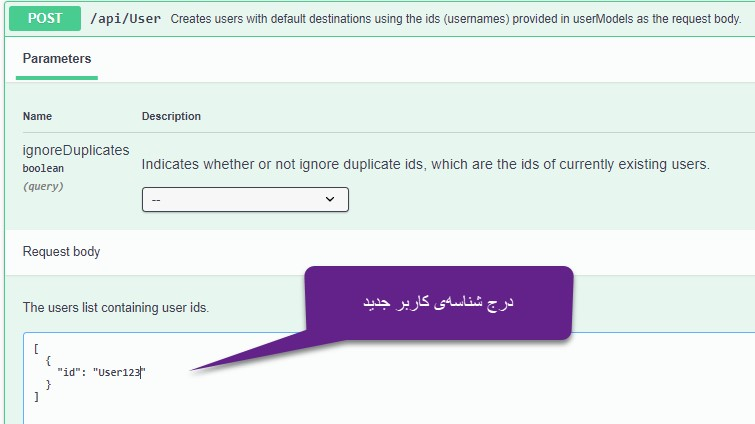

شکل 83: وب‌سرویس ایجاد کاربر

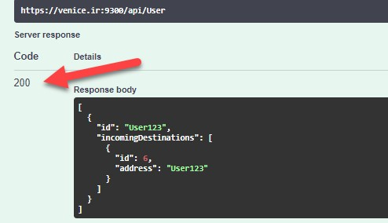

شکل 84: پاسخ وب‌سرویس ایجاد کاربر

### بازیابی کاربر

از طریق شناسه‌ای که به وب‌سرویس ارسال می‌شود، اطلاعات کاربر در خروجی قرار خواهد گرفت.

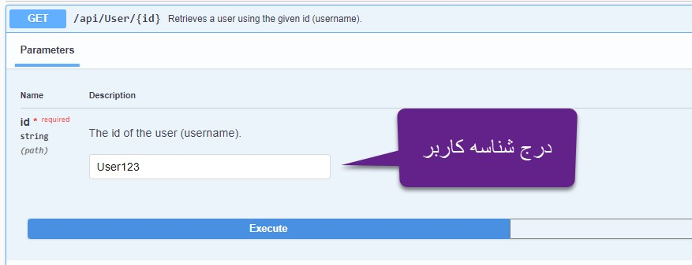

شکل 85: وب‌سرویس بازیابی کاربر

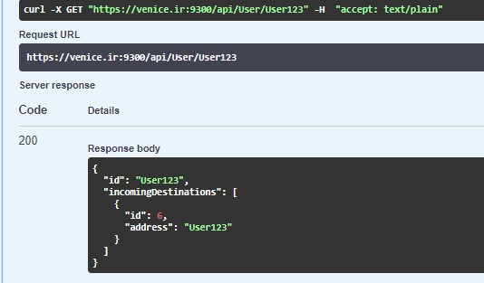

شکل 86: پاسخ وب‌سرویس بازیابی کاربر

### حذف کاربر

با ارسال شناسه کاربر موردنظر به وب‌سرویس زیر، کاربر حذف می‌شود.

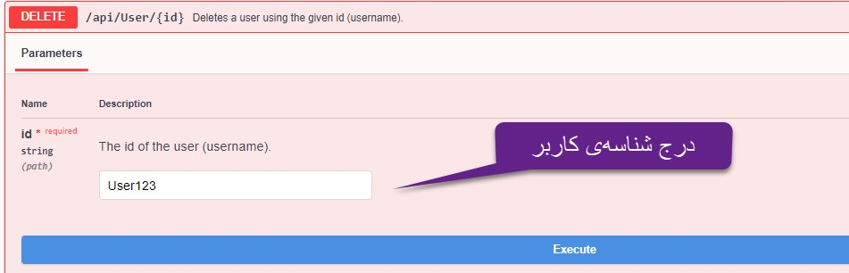

شکل 87: وب‌سرویس حذف کاربر

## وب‌سرویس‌های ارسال پیام

### ارسال پیام جدید

کافی است در قسمت مشخص‌شده در تصویر، شناسه کاربر را درج و در بدنه درخواست آدرس‌های مقصد و اطلاعات پیام قرار داده شود.

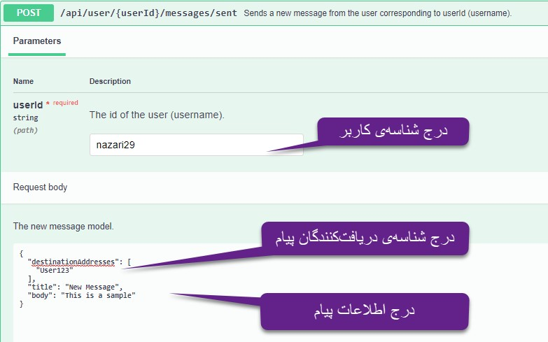

شکل 88: وب‌سرویس ارسال پیام جدید

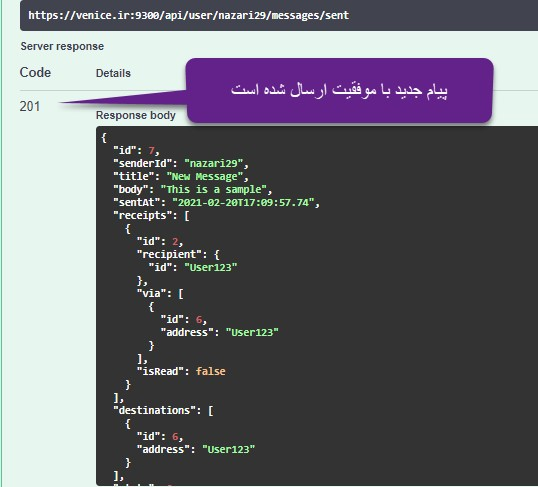

شکل 89: پاسخ وب‌سرویس ارسال پیام جدید

### بازیابی پیام ارسال شده کاربر

برای اینکه پیام ارسال شده کاربر موردنظر را بازیابی کرد، باید شناسه کاربر و شناسه پیام ارسال‌شده به وب‌سرویس زیر ارسال شود.

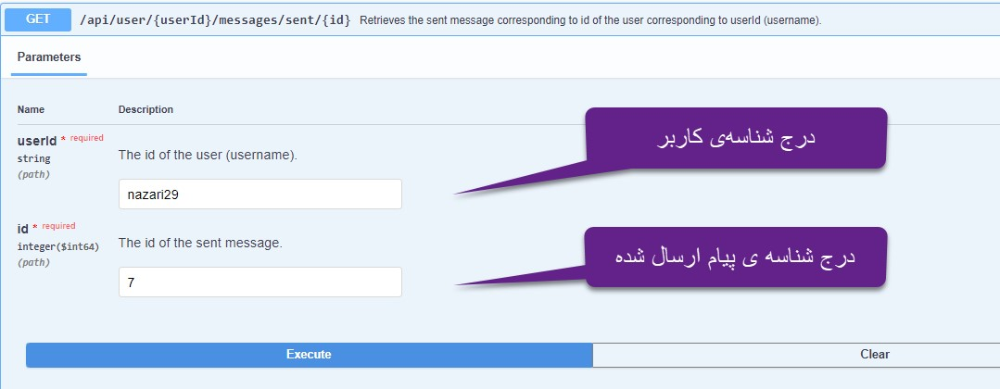

شکل 90: وب‌سرویس بازیابی پیام ارسال‌شده کاربر

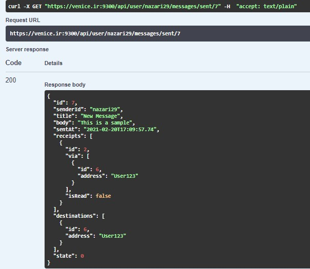

شکل 91: پاسخ وب‌سرویس بازیابی پیام ارسال شده کاربر

### بازیابی تمام پیام‌های ارسال‌شده کاربر

از طریق ارسال شناسه کاربر موردنظر به وب‌سرویس زیر، تمامی پیام‌های ارسال‌شده کاربر بازیابی می‌شود.

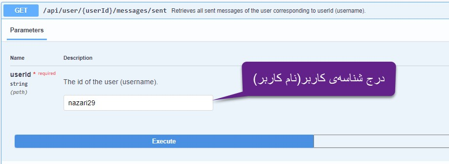

شکل 92: وب‌سرویس بازیابی تمام پیام‌های ارسال شده کاربر

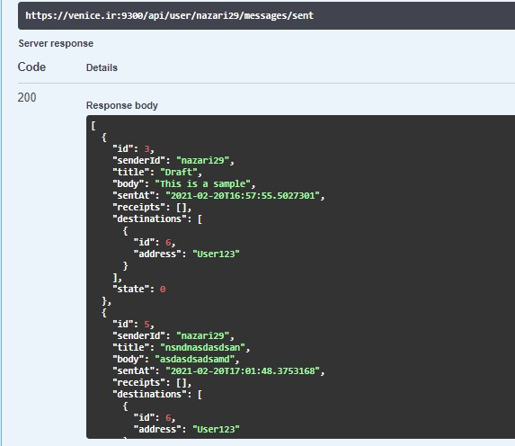

شکل 93: پاسخ وب‌سرویس بازیابی تمام پیام‌های ارسال شده کاربر

### بازیابی تمام ارسال‌های بعدی از پیام ارسالی کاربر

به طور مثال، اگر user1 پیامی را به user2 ارسال نماید و سپس user2 این پیام دریافت‌شده را به user3 ارسال نماید، از طریق فراخوانی وب‌سرویس فوق می‌توان تمام ارسال‌های بعدی این پیام را مشاهده نمود. کافی است شناسه کاربر و شناسه پیام ارسال‌شده به وب‌سرویس زیر ارسال شود، تا تمامی ارسال‌های بعدی انجام‌شده از این پیام بازیابی شود.

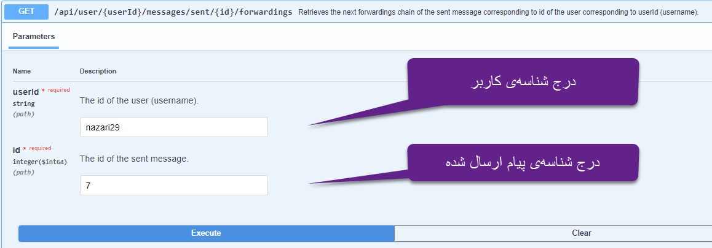

شکل 94: وب‌سرویس بازیابی تمام ارسال‌های بعدی از پیام ارسال شده کاربر

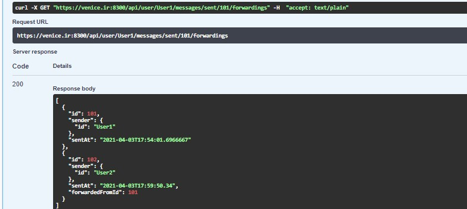

شکل 95: پاسخ وب‌سرویس بازیابی تمام ارسال‌های بعدی از پیام ارسال‌شده کاربر

## وب‌سرویس‌های پیام دریافتی

    ### ارسال پیام دریافتی
      برای ارسال پیام دریافتی موردنظر، کافی است شناسه کاربر و شناسه پیام دریافتی را در قسمت مشخص‌شده در تصویر زیر درج و در قسمت بدنه درخواست آدرس مقصد موردنظر را درج نمایید.

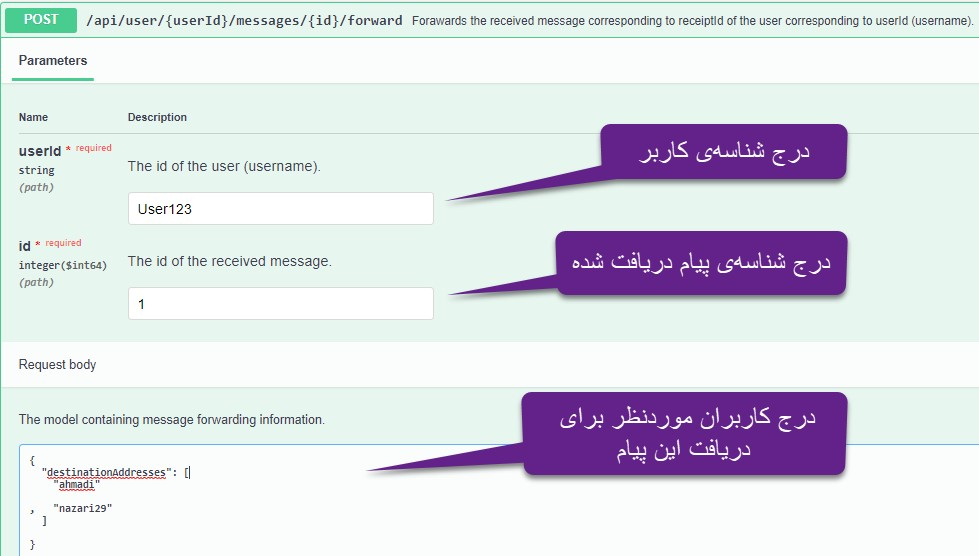

شکل 96: وب‌سرویس ارسال پیام دریافتی

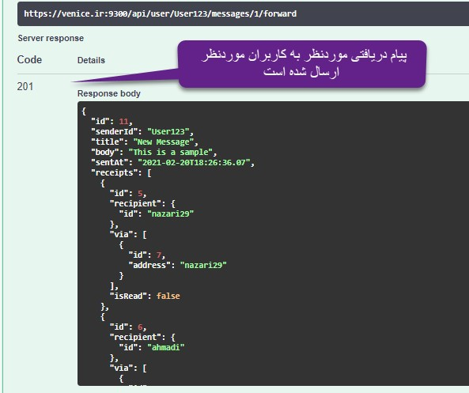

شکل 97: پاسخ وب‌سرویس ارسال پیام دریافتی

### بازیابی پیام دریافت‌شده کاربر

با ارسال شناسه کاربر و شناسه پیام دریافت‌شده برای وب‌سرویس زیر می‌توان اطلاعات پیام دریافت‌شده را بازیابی نمود.

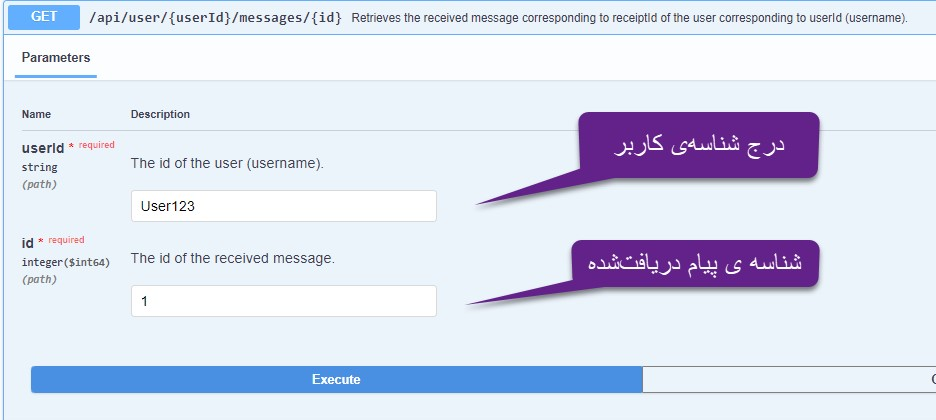

شکل 98: وب‌سرویس بازیابی پیام دریافت شده کاربر از طریق شناسه

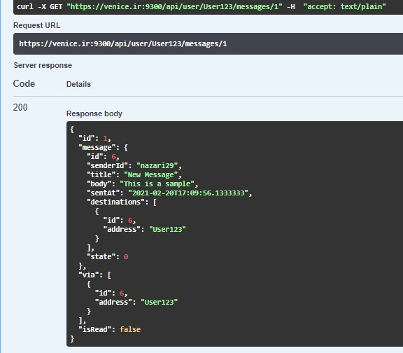

شکل 99: پاسخ وب‌سرویس بازیابی پیام دریافت‌شده کاربر

### بازیابی تمام پیام‌های دریافت‌شده کاربر

کافی است شناسه کاربر موردنظر را برای وب‌سرویس زیر ارسال نمایید. همچنین در این وب‌سرویس فیلدهای انتخابی دیگری نیز وجود دارد؛ از جمله:

- فیلد Sender که در این فیلد می‌توان شناسه فرستنده را درج کرد.
- فیلد Via که با استفاده از آن می‌توان مقصدهای پیام‌های دریافت‌شده را مشخص کرد.
- فیلد isRead مشخص می‌کند که آیا پیام دریافتی به‌عنوان خوانده‌شده نشان‌گذاری شود یا خیر.

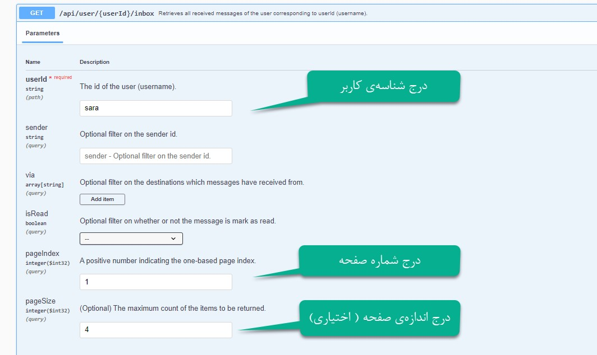

شکل 100: وب‌سرویس بازیابی تمام پیام‌های دریافت‌شده کاربر

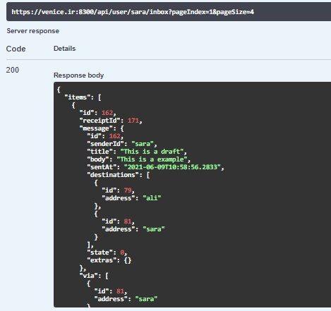

شکل 101: پاسخ وب‌سرویس بازیابی تمام پیام‌های دریافت‌شده کاربر

### نشانه‌گذاری پیام دریافت‌شده به عنوان خوانده‌شده یا خوانده‌نشده

برای اینکه بتوان پیام دریافتی برای کاربر موردنظر را به پیام خوانده‌شده تبدیل کرد، کافی است با استفاده از وب‌سرویس زیر، شناسه کاربر و شناسه پیام دریافتی را در قسمت مشخص‌شده در تصویر زیر درج و در قسمت بدنه درخواست، کلید isRead را مقداردهی نمایید و سپس دکمه Execute را انتخاب نمایید.

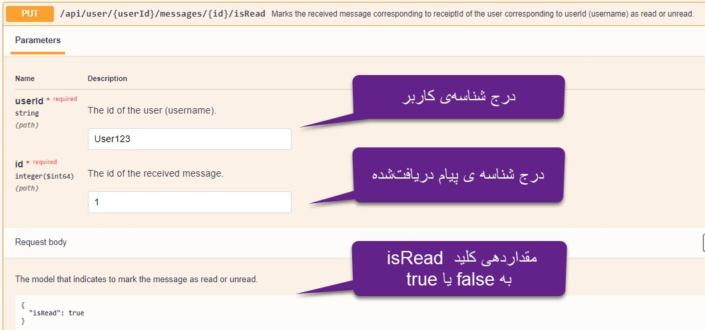

شکل 102: وب‌سرویس نشانه‌گذاری پیام دریافت‌شده به‌عنوان خوانده‌شده یا خوانده‌نشده

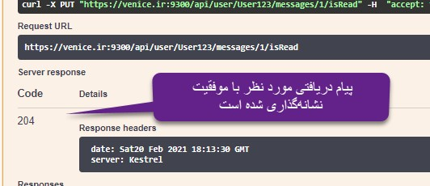

شکل 103: پاسخ وب‌سرویس نشانه‌گذاری پیام دریافت‌شده به‌عنوان خوانده‌شده یا خوانده‌نشده

### بازیابی ارسال‌های قبلی انجام شده از پیام دریافتی کاربر

کافی است شناسه کاربر و شناسه پیام دریافت‌شده به وب‌سرویس زیر ارسال شود تا تمامی ارسال‌های قبلی انجام‌شده از این پیام، نشان داده شود.

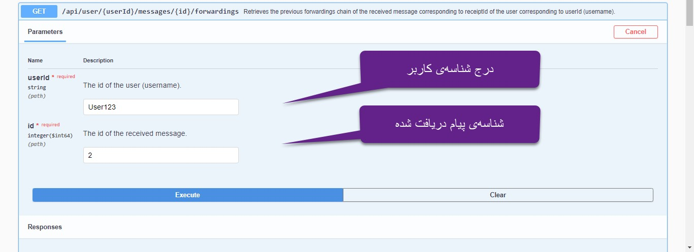

شکل 104: وب‌سرویس بازیابی ارسال‌های قبلی انجام‌شده از پیام دریافتی کاربر

## وب‌سرویس‌های پیش‌نویس

### ایجاد پیش‌نویس برای کاربر موردنظر

برای ایجاد پیش‌نویس برای کاربر موردنظر، کافی است شناسه کاربر مورد نظر را در قسمت مشخص‌شده در تصویر درج و اطلاعات پیش‌نویس را در قسمت بدنه درخواست درج نمایید.

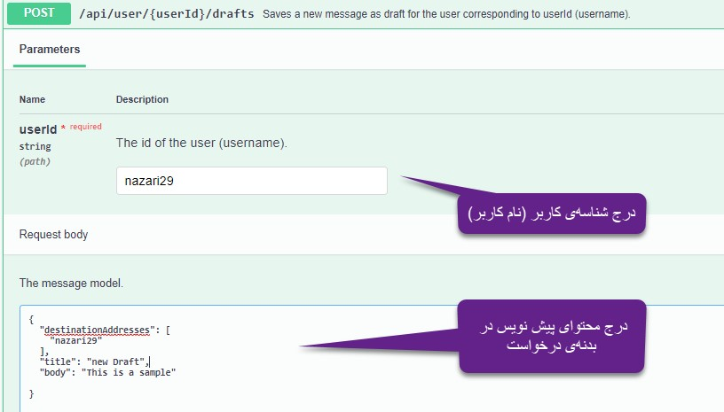

شکل 105: وب‌سرویس ایجاد پیش‌نویس برای کاربر موردنظر

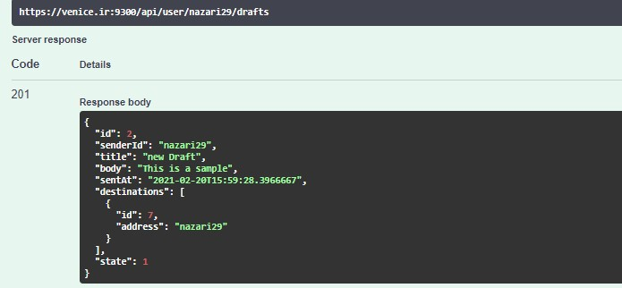

شکل 106: پاسخ وب‌سرویس ایجاد پیش‌نویس برای کاربر موردنظر

### بازیابی پیش‌نویس موردنظر برای کاربر مشخص

برای بازیابی اطلاعات پیش‌نویس موردنظر برای کاربر مشخص، کافی است شناسه کاربر و شناسه پیش‌نویس را برای وب‌سرویس ارسال نمایید.

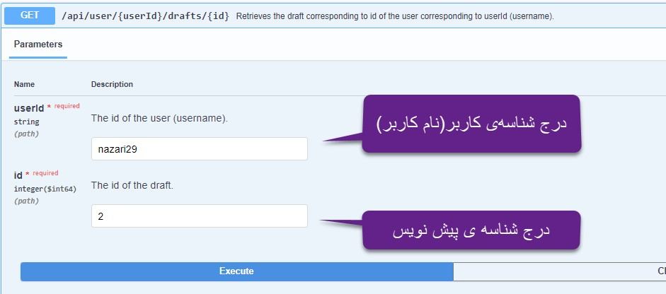

شکل 107: وب‌سرویس بازیابی پیش‌نویس موردنظر برای کاربر مشخص

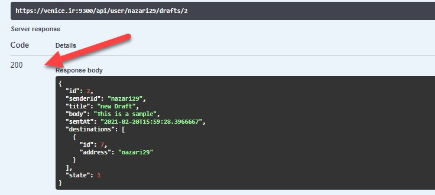

شکل 108: پاسخ وب‌سرویس بازیابی پیش‌نویس موردنظر برای کاربر مشخص

### به‌روزرسانی پیش‌نویس

برای به‌روزرسانی پیش‌نویس برای کاربر موردنظر، کافی است شناسه کاربر و شناسه پیش‌نویس موردنظر را در قسمت مشخص‌شده در تصویر درج و در قسمت بدنه درخواست اطلاعات پیش‌نویس را قرار داده و سپس دکمه Execute را انتخاب نمایید.

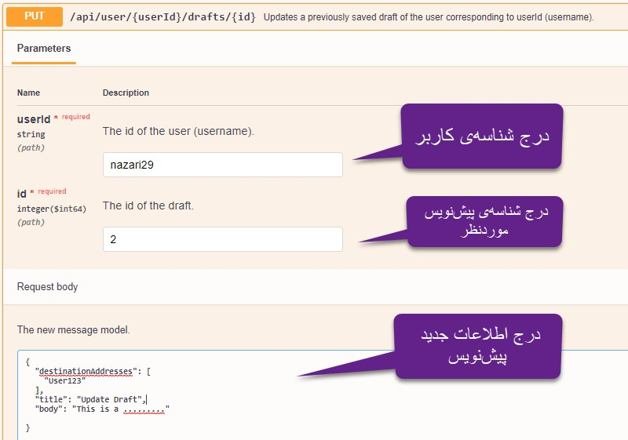

شکل 109: وب‌سرویس به‌روزرسانی پیش‌نویس

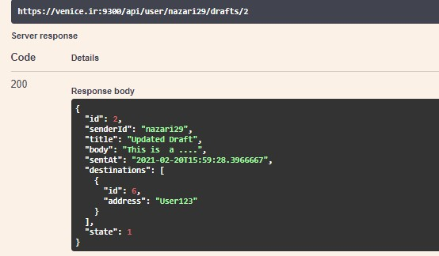

شکل 110: پاسخ وب‌سرویس به‌روزرسانی پیش‌نویس

### حذف پیش‌نویس

برای حذف پیش‌نویس مورد نظر برای کاربر مشخص، کافی است شناسه کاربر و شناسه پیش‌نویس موردنظر را برای وب‌سرویس زیر ارسال نمایید.

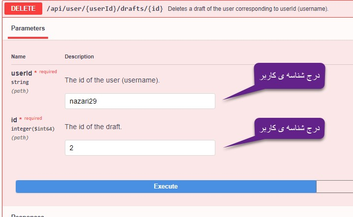

شکل 111: وب‌سرویس حذف پیش‌نویس

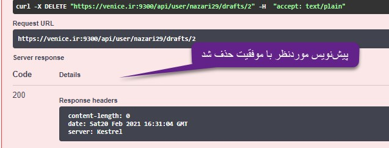

شکل 112: پاسخ وب‌سرویس حذف پیش‌نویس

### بازیابی تمام پیش‌نویس‌های کاربر مورد نظر

برای این کار کافی است، شناسه کاربر موردنظر را برای وب‌سرویس زیر ارسال نمایید.

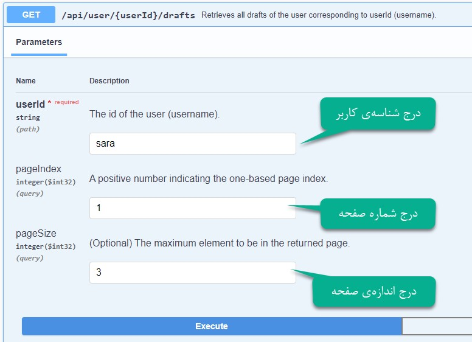

شکل 113: وب‌سرویس بازیابی تمام پیش‌نویس‌های کاربر موردنظر

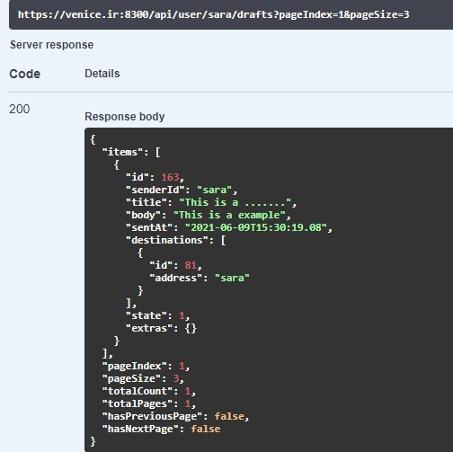

شکل 114: پاسخ وب‌سرویس بازیابی تمام پیش‌نویس‌های کاربر موردنظر

### ارسال پیش‌نویس ذخیره‌شده کاربر

برای ارسال پیش‌نویس موردنظر که قبلاً برای کاربر ذخیره شده است، کافی است شناسه کاربر و شناسه پیش‌نویس را برای وب‌سرویس زیر ارسال نمایید.

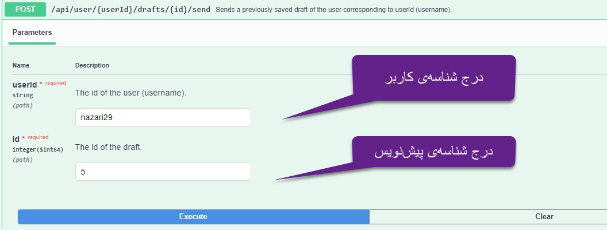

شکل 115: وب‌سرویس ارسال پیش‌نویس ذخیره‌شده کاربر

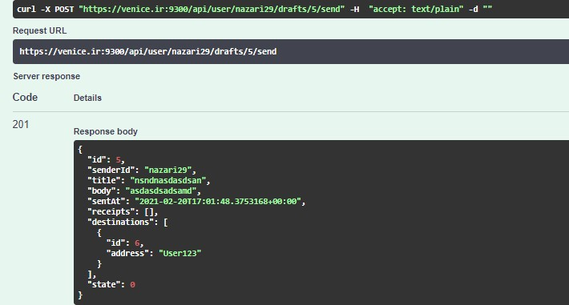

شکل 116: پاسخ وب‌سرویس ارسال پیش‌نویس ذخیره‌شده کاربر

## وب‌سرویس صندوق

در این وب‌سرویس کاربر می‌تواند پیام دریافتی، پیام ارسال‌شده و یا حتی پیام ذخیره‌شده به‌عنوان پیش‌نویس را به دریافت‌کنندگان موردنظر خود ارسال نماید. کافی است شناسه کاربر و شناسه پیام را برای وب‌سرویس ارسال و در قسمت بدنه درخواست شناسه دریافت‌کنندگان موردنظر خود را درج نماید.

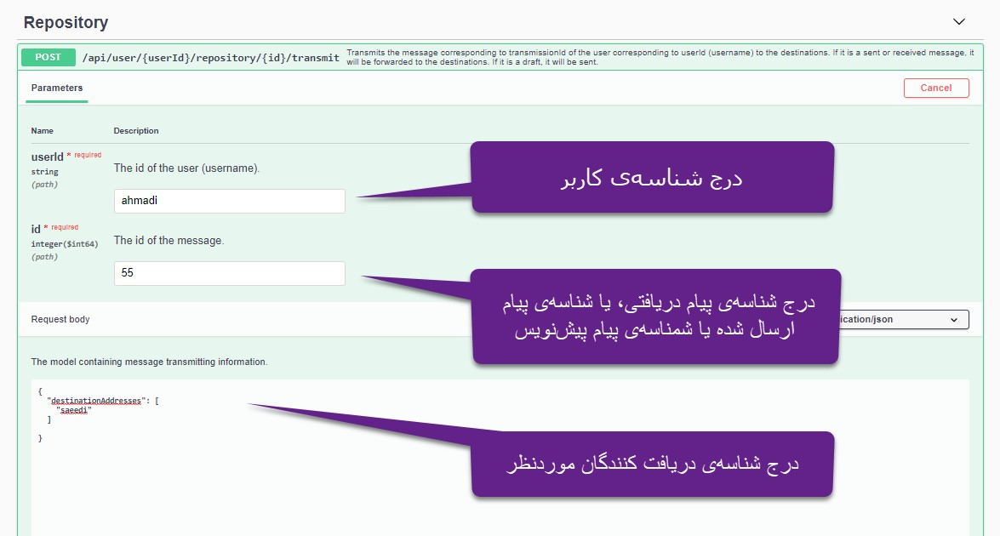

شکل 117: وب‌سرویس صندوق

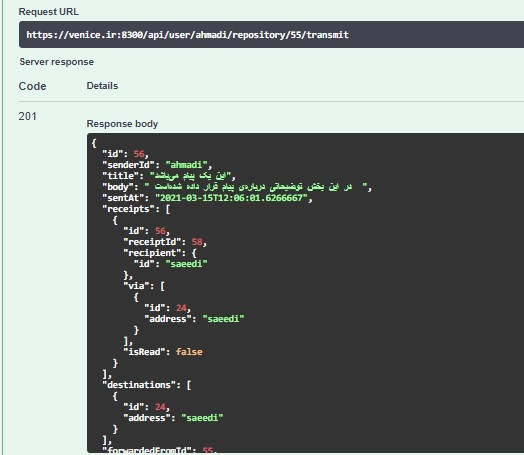

شکل 118: پاسخ وب‌سرویس صندوق

## وب‌سرویس‌های مقصد

در این وب‌سرویس‌ها، امکان ایجاد مقصد جدید به همراه مشخص کردن دریافت‌کنندگان موردنظر از این مقصد، به‌روزرسانی آدرس مقصد، حذف مقصد و بازیابی مقصد موردنظر فراهم شده است.

### ایجاد مقصد

برای ایجاد مقصد جدید، کافی است از طریق وب‌سرویس زیر، آدرس مقصد و همچنین لیست دریافت‌کنندگان را در قسمت بدنه درخواست درج نموده و سپس دکمه Execute را انتخاب نمایید.

شکل 119: وب‌سرویس ایجاد مقصد

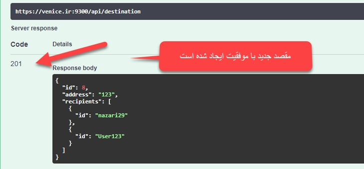

شکل 120: پاسخ وب‌سرویس ایجاد مقصد

### بازیابی مقصد با استفاده از شناسه

این وب‌سرویس از طریق شناسه‌ای که دریافت می‌کند، اطلاعات مقصد به همراه دریافت‌کنندگانی که از این آدرس پیامی دریافت می‌کنند را بازیابی می‌کند.

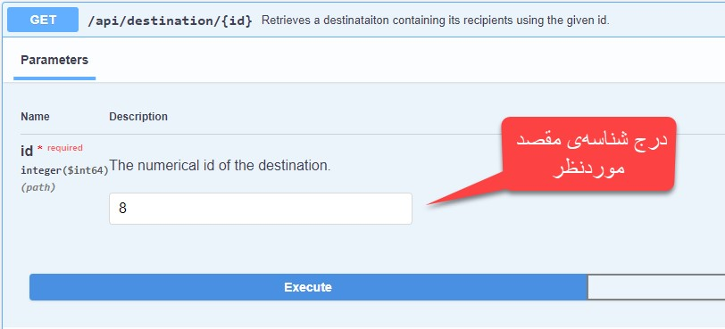

شکل 121: بازیابی مقصد با استفاده از شناسه

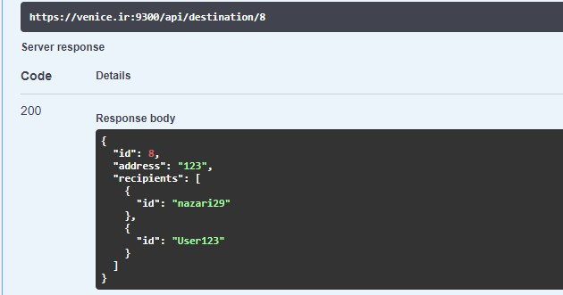

شکل 122: پاسخ وب‌سرویس بازیابی مقصد از طریق شناسه

### به‌روزرسانی آدرس مقصد

برای به‌روزرسانی آدرس مقصد کافی است، شناسه مقصد را در قسمت مشخص‌شده در تصویر زیر درج و در بدنه درخواست آدرس جدید را وارد کرده و سپس دکمه Execute را انتخاب نمایید.

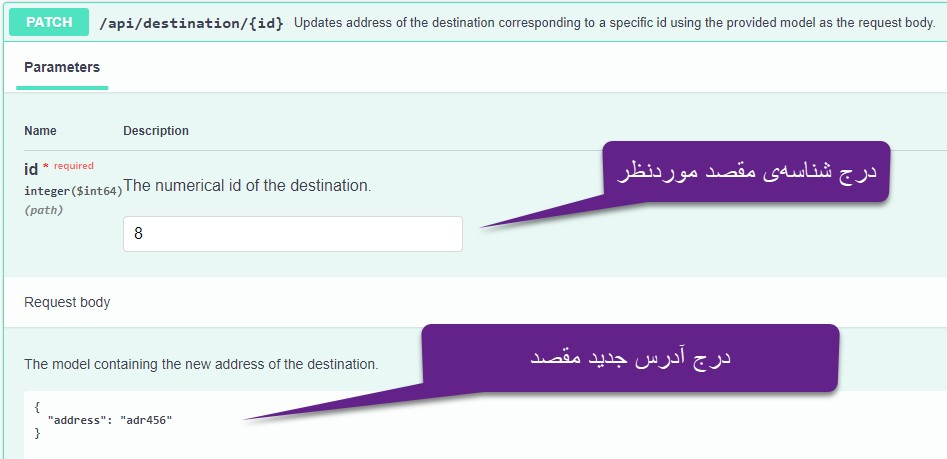

شکل 123: وب‌سرویس به‌روزرسانی آدرس مقصد

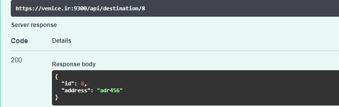

شکل 124: پاسخ وب‌سرویس به‌روزرسانی آدرس مقصد

### حذف مقصد

برای اینکه بتوان مقصدی را حذف کرد کافی است، شناسه مقصد را برای وب‌سرویس زیر ارسال نمایید.

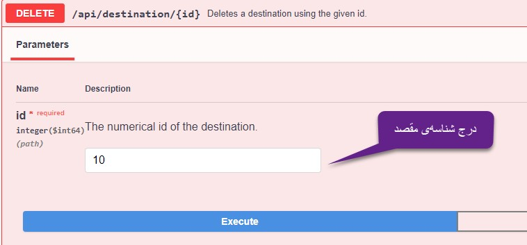

شکل 125: وب‌سرویس حذف مقصد

### بازیابی مقصد با استفاده از آدرس

برای بازیابی مقصد به همراه دریافت‌کنندگانی که از این آدرس پیامی دریافت کرده‌اند، کافی است آدرس مقصد را برای وب‌سرویس زیر ارسال نمایید.

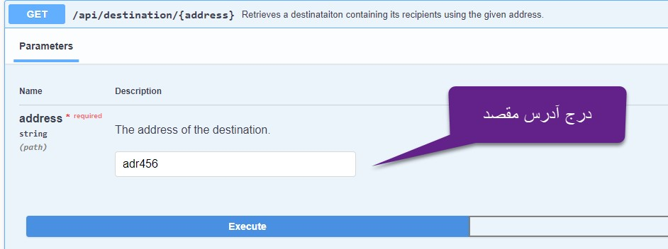

شکل 126: وب‌سرویس بازیابی مقصد با استفاده از آدرس

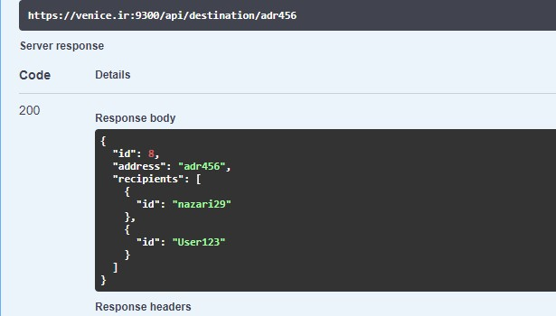

شکل 127: پاسخ وب‌سرویس بازیابی مقصد با استفاده از آدرس

### به‌روزرسانی آدرس مقصد با استفاده از آدرس

از طریق وب‌سرویس زیر می‌توان آدرس مقصد را به‌روزرسانی کرد. به این طریق که آدرس قبلی را در قسمت مشخص‌شده در تصویر زیر قرار داده و در قسمت بدنه درخواست آدرس جدید را درج کرده و سپس دکمه Execute را انتخاب نمایید.

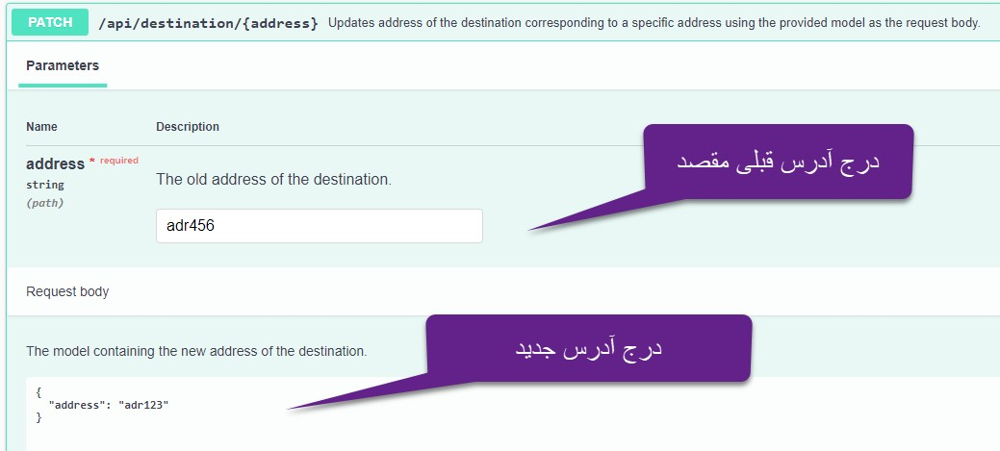

شکل 128: وب‌سرویس به‌روزرسانی آدرس مقصد از طریق آدرس

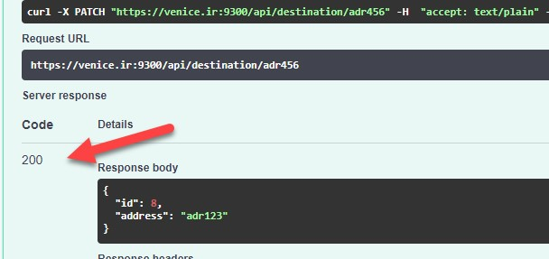

شکل 129: پاسخ وب‌سرویس به‌روزرسانی آدرس مقصد از طریق آدرس

## وب‌سرویس‌های دریافت‌کنندگان مقصد

در این وب‌سرویس‌ها، امکاناتی از جمله بازیابی تمام دریافت‌کنندگانی که از مقصد موردنظر پیامی دریافت کرده‌اند، امکان افزودن دریافت‌کننده‌های جدید به مقصد موردنظر و همچنین حذف دریافت‌کننده‌هایی از مقصد موردنظر، فراهم‌شده است.

### بازیابی تمام دریافت‌کنندگان پیام از آدرس موردنظر

با استفاده از وب‌سرویس زیر، می‌توان تمامی دریافت‌کنندگان پیام از آدرس داده‌شده را بازیابی کرد. به این صورت که آدرس موردنظر را برای وب‌سرویس زیر ارسال نمایید.

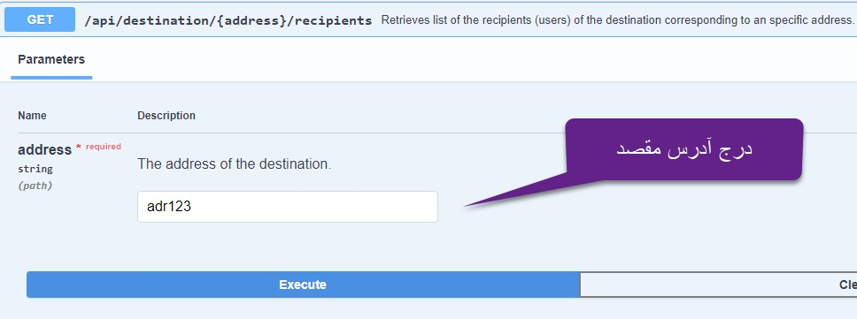

شکل 130: وب‌سرویس بازیابی تمام دریافت‌کنندگان پیام از آدرس موردنظر

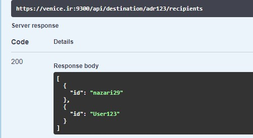

شکل 131: پاسخ وب‌سرویس بازیابی تمام دریافت‌کنندگان پیام از آدرس موردنظر

### افزودن گیرندگان جدید به آدرس موردنظر

برای افزودن دریافت‌کنندگان جدید پیام به مقصد موردنظر، کافی است آدرس مقصد موردنظر را در قسمت مشخص‌شده در تصویر زیر درج و در بدنه درخواست لیست دریافت‌کنندگان را مشخص نمایید.

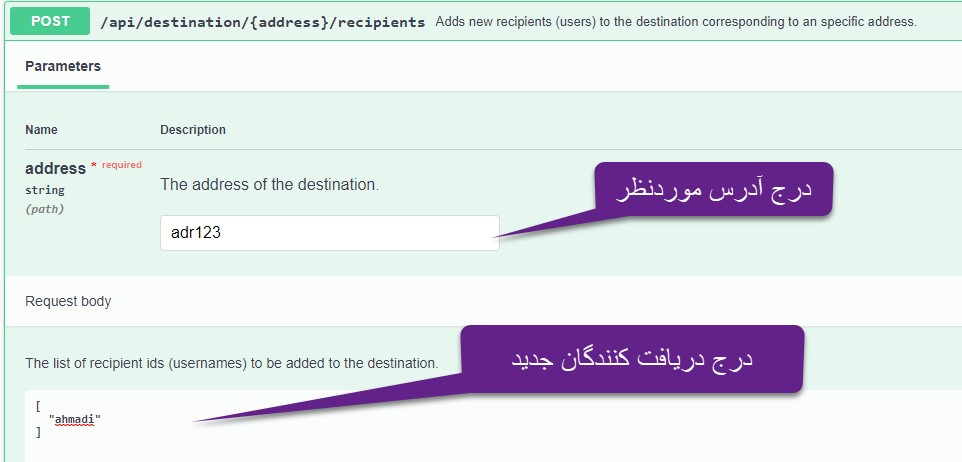

شکل 132: وب‌سرویس افزودن دریافت‌کنندگان جدید به آدرس موردنظر

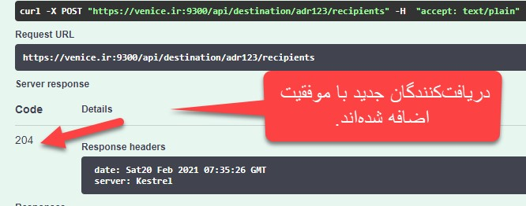

شکل 133: پاسخ وب‌سرویس افزودن دریافت‌کنندگان جدید به آدرس موردنظر

### حذف گیرندگان پیام از مقصد موردنظر

با استفاده از وب‌سرویس زیر می‌توان لیست دریافت‌کنندگان موردنظر خود را از مقصد مشخص‌شده حذف کرد، کافی است ابتدا آدرس موردنظر را در قسمت مشخص‌شده در تصویر زیر درج و سپس افراد موردنظر را در قسمت مشخص‌شده اضافه کرد و سپس دکمه Execute را انتخاب نمایید. لازم به ذکر است اگر مقصد موردنظر بعد از حذف گیرنده‌ها، فاقد گیرنده‌ای باشد، خود مقصد نیز حذف خواهد شد.

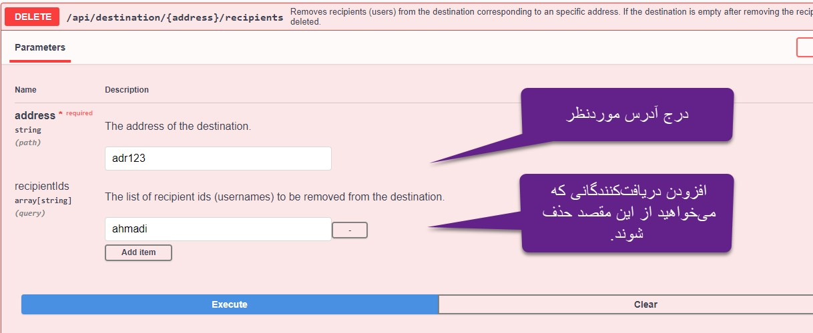

شکل 134: وب‌سرویس حذف گیرندگان پیام از مقصد موردنظر

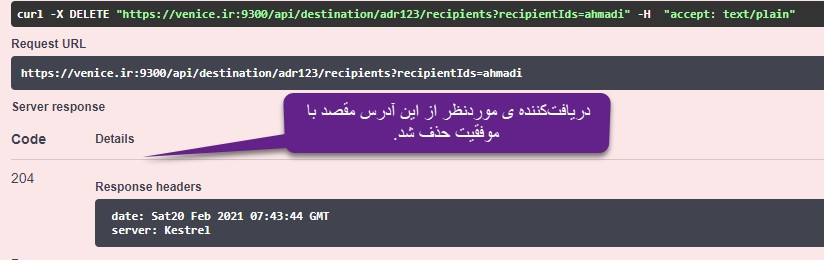

شکل 135: پاسخ وب‌سرویس حذف گیرندگان پیام از مقصد موردنظر

