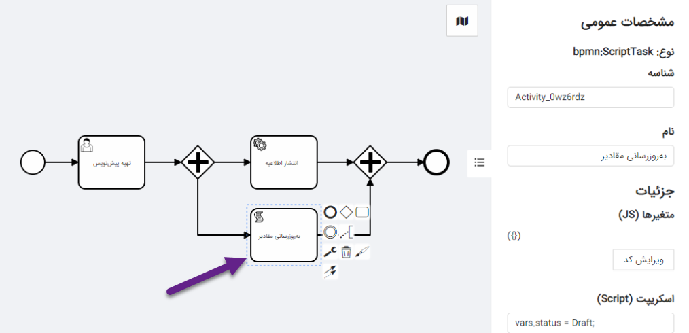
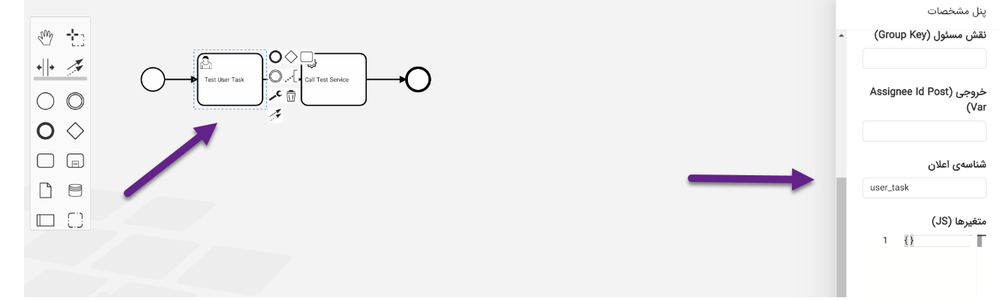

# راهنمای طراحی گردش کار

در این فصل به معرفی تمامی عناصری که در طراحی یک گردش کار کاربرد داشته و در موتور گردش کار پشتیبانی می‌شوند، پرداخته شده است. پیش از هر چیز، باید این نکته را خاطرنشان کرد که تمامی عناصر مذکور اعم از فعالیت، رویدادها و درگاه‌ها، زیرمجموعه‌ای از عناصر استاندارد در زبان مدل‌سازی BPMN هستند. برای آشنایی بیشتر با این زبان مدل‌سازی می‌توان به درگاه رسمی این استاندارد و مستندات رسمی آن مراجعه نمود.

## انواع رویداد شروع

<center></center>

رویداد شروع جایی است که هر گردش‌کار از آن نقطه آغاز می‌شود. این رویداد شروع می‌تواند انواع مختلفی مانند ساده، پیام، زمان‌بندی‌شده، سیگنال و شرطی باشد.

### رویداد شروع ساده

زمانی از این رویداد شروع استفاده می‌شود که بخواهید شروع یک نمونه از گردش‌کار موردنظر را از طریق فراخوانی یک وب‌سرویس آغاز نمایید. به‌بیان‌دیگر، موتور گردش‌کار نمی‌تواند زمان شروع این نمونه از گردش‌کار را پیش‌بینی کند و هر زمان که وب‌سرویس شروع گردش‌کار برای گردش‌کار موردنظر فراخوانی شد، اجرای یک نمونه از این گردش کار آغاز خواهد شد.

برای این رویداد دو فیلد شناسه و نام تعریف شده است. در صورت تمایل می‌توان شناسه رویداد را تغییر دهید. همچنین نام موردنظر خود را برای این رویداد در ورودی دوم درج نمایید.

<center></center>

<center>شکل 25: مثالی از رویداد شروع ساده</center>

<center></center>

<center>شکل 26: مشخصات رویداد شروع</center>

### رویداد شروع سیگنال

زمانی از این رویداد شروع استفاده می‌شود که بخواهید یک نمونه از گردش‌کار موردنظر را از طریق دریافت یک سیگنال آغاز نمایید. یعنی تنها زمانی گردش‌کار می‌تواند آغاز شود که سیگنالی از فرایند دیگری منتشر شده باشد در غیر این صورت گردش‌کار نمی‌تواند شروع به کار نماید. یک سیگنال را ممکن است چندین گردش‌کار مختلف منتشرکنند و چندین گردش‌کار آن را دریافت کنند. درواقع سیگنال، پیغامی است که در سطح کل سیستم انتشار داده می‌شود.

رویداد شروع سیگنال دارای مشخصات زیر است:

- **کلید سیگنال:** یک رشته ‌است که بوسیله‌ی این کلید سیگنال‌ها از یکدیگر شناخته می‌شوند.

شایان ذکر است که کلید سیگنال بایستی حتما در جدول سیگنال‌ها تعریف شده باشد. به بیان دیگر، مقدار این کلید باید از بین مقادیر موجود در جدول سیگنال‌ها انتخاب شود.


<center>شکل 27: مشخصات سیگنال و مثالی از آن</center>

### رویداد شروع زمان‌بند

زمانی از این رویداد شروع استفاده می‌شود که بخواهید یک نمونه از گردش‌کار موردنظر را در زمانی مشخص یا در طی دوره‌ی‌ زمانی آغاز نمایید. هر رویداد زمانبند باید زمان دقیق یا دوره‌ی زمانی داشته باشد. زمانی‌که یک زمانبند فعال می‌شود، یک نمونه فرایند جدید ایجاد می‌شود و رویداد شروع زمان‌بند مربوطه فعال می‌شود.

` `گره شروع زمان‌بند می‌تواند تنها یکی از مقادیر زیر را دریافت نماید. به بیان‌دیگر برای زمان‌بند 4 حالت وجود دارد.

**زمان دقیق:** زمان دقیقی که قراراست این رویداد فعال شود. با کلیک بر روی فیلد ورودی زمان دقیق ، یک تقویم ظاهر می‌شود که به‌کمک آن می‌توان تاریخ و زمان دقیق مشخص شود. در واقع این حالت برای مواردی استفاده می‌شود که بخواهید زمان‌بند را در تاریخی مشخص فعال نمایید.

<center></center>

<center>شکل 28: زمان دقیق زمان‌بند</center>

- **مدت زمان انتظار:** منظور مدت زمان انتظاری است که بعد از رسیدن به گره شروع زمان‌بند در گردش‌کار باید صرف شود تا زمان‌بند فعال شود و اجرای گردش‌کار آغاز شود. درواقع همان فاصله‌ی زمانی نسبت به زمان فعلی می‌باشد. کافی‌است روز و زمان را مشخص نمایید.

<center></center>

<center>شکل 29: مدت زمان انتظار</center>

- **دوره‌ی اجرا:** زمانی‌که بخواهید یک رویداد را بطورمنظم یعنی روزانه و یا هفتگی و یا ماهانه تکرار نمایید، از این حالت استفاده می‌شود. در این صورت باید نوع دوره را مشخص و زمان دقیق آن را مشخص نمایید. بطور مثال این رویداد قرار است هر روز ساعت 12 آغاز شود.

<center></center>

<center>شکل 30: دوره‌ی اجرا</center>

- **دوره‌ی زمانی:** این حالت برای زمانی‌است که بخواهید فرایندی را از یک تاریخ تا یک تاریخ‌ موردنظر چندین بار برحسب دوره‌تناوب مشخص‌شده اجرا نمایید. دراین حالت کافی‌است تاریخ شروع و پایان رویداد را مشخص و تعداد تکرار این رویداد را مشخص و نیز دوره‌تناوبی که قرار است این رویداد را تکرار کند ( برحسب روز) را تعیین و درنهایت زمان را مشخص نمایید.

<center></center>

<center>شکل 31: دوره‌ی زمانی</center>


<center>شکل 32: مثالی از زمان‌بند شروع</center>

## انواع رویداد میانی

از این رویداد می‌توان برای نشان‌دادن چیزی که اتفاق افتاده ( رویدادهای پرتاب میانی) یا برای منتظرماندن و واکنش به رویدادهای خاص (رویدادهای دریافت میانی) استفاده شود. این رویداد انواع مختلفی مانند دریافت سیگنال میانی، پرتاب سیگنال میانی، دریافت زمانبند میانی، دریافت پیام میانی، پرتاب پیام میانی و ... می‌باشد.

<center></center>

### رویداد زمان‌بند میانی

از این رویداد زمانی استفاده می‌شود که بخواهید در نمونه‌ی اجرای گردش‌کاری یک وقفه‌ای را ایجاد نمایید. در اجرای فرایند به محض رسیدن به این گره، نمونه‌ فرایند در این نقطه متوقف شده و منتظر می‌ماند تا زمانبند فعال شود و زمانی‌که زمانبند فعال شد، رویداد catch کامل شده و نمونه‌ فرایند ادامه پیدا می‌‌کند. برای این رویداد باید زمان دقیق یا زمان نسبی تعریف شده باشد که مشخص می‌کند که این رویداد چه زمانی فعال شود.

بنابراین گره زمان‌بند میانی می‌تواند تنها یکی از مقادیر زیر را دریافت نماید.

- ` `**زمان دقیق:** زمان دقیقی که قراراست این رویداد فعال شود. با کلیک بر روی فیلد ورودی زمان دقیق ، یک تقویم ظاهر می‌شود که به‌کمک آن می‌توان تاریخ و زمان دقیق مشخص شود. در واقع این حالت برای مواردی استفاده می‌شود که بخواهید زمان‌بند را در تاریخی مشخص فعال نمایید. ( مشابه شکل 28)
- **مدت زمان انتظار:** منظور مدت زمان انتظاری است که بعد از رسیدن به گره زمان‌بند میانی در گردش‌کار باید صرف‌شود تا زمانبند فعال شود و اجرای گردش‌کار ادامه‌ پیداکند.‌‌ کافی‌است تعداد روزی که باید این رویداد منتظر بماند را تعیین و سپس زمان دقیق را مشخص نمایید. ( مشابه شکل 29)

در مثال زیر به محض رسیدن به گره‌ی زمان‌بند میانی، 15 دقیقه منتظر مانده و سپس اجرای گردش‌کار ادامه پیدا می‌کند.


<center>شکل 33: مثالی از رویداد زمانبند میانی</center>

### رویداد سیگنال پرتاب میانی

از این رویداد زمانی استفاده می‌شود که بخواهید در طی اجرای فرایندی سیگنالی را منتشر نمایید. بطورکلی به دو صورت می‌توان یک سیگنال را انتشار داد، اولی از طریق سیگنال پرتاب پایانی و دومی از طریق سیگنال پرتاب میانی. در طی اجرای گردش‌کار به محض رسیدن به این گره، یک سیگنال پرتاب می‌شود. با پرتاب این سیگنال ممکن است فرایندهای دیگری آغاز شده و یا نمونه‌ فرایندهایی به اجرای خود ادامه دهند.

مشخصات این رویداد مشابه مشخصات رویداد شروع سیگنال است.


<center>شکل 34: مثالی از رویداد پرتاب سیگنال میانی</center>

### رویداد دریافت سیگنال میانی

از این رویداد زمانی استفاده می‌شود که بخواهید یک سیگنال را در طی گردش‌کاری دریافت نمایید. درواقع هنگام رسیدن به این گره، نمونه فرایند درحال اجرا متوقف شده و منتظر سیگنال می‌ماند. به محض انتشار سیگنال از طریق فرایند دیگری، این فرایند سیگنال را دریافت و به اجرای خود ادامه می‌دهد. شایان ذکر است به دوصورت می‌توان یک سیگنال را دریافت نمود، اولی از طریق رویداد شروع سیگنال و دومی از طریق رویداد دریافت سیگنال میانی.

مشخصات این رویداد مشابه مشخصات رویداد شروع سیگنال است.


<center>شکل 35: مثالی از رویداد دریافت سیگنال میانی</center>

## انواع رویداد پایان

<center></center>

رویداد پایان جایی است که یک گردش کار به آن نقطه ختم می‌شود. رویداد پایان می‌تواند انواع مختلفی مانند ساده، پیام، سیگنال و موارد دیگر باشد.

### رویداد پایان ساده

برای پایان دادن به مسیر اجرای گردش کار از این رویداد استفاده می‌شود. نکته حائز اهمیت این است که به دلیل اینکه نتیجه پرتاب‌شده در هنگام رسیدن به این رویداد مشخص نیست، این رویداد تنها به مسیر اجرای فعلی گردش کار پایان می‌دهد و کار دیگری انجام نمی‌دهد.

همانند رویداد شروع، برای این رویداد نیز دو فیلد شناسه و نام تعریف‌شده که در صورت تمایل می‌توان نام دلخواه خود را درج و شناسه پیش‌فرض را تغییر دهید.


<center>شکل 36: مثالی از رویداد پایان ساده</center>

### رویداد پایان سیگنال

در این رویداد به محض خاتمه‌ی فرایند یک سیگنال منتشر می‌شود. در واقع از این رویداد برای پرتاب یک سیگنال استفاده می‌شود. این سیگنال منتشرشده ممکن است باعث آغاز اجرای فرایندهای دیگر و یا ادامه‌ی اجرای فرایندهایی که منتظر دریافت این سیگنال هستند، شود.

مشخصات این رویداد مشابه رویداد شروع و رویداد میانی سیگنال می‌باشد.


<center>شکل 37: مثالی از رویداد پایان سیگنال</center>

## انواع فعالیت‌ها

<center></center>

فعالیت‌ها، اقداماتی هستند که در گام‌های مختلف گردش کار به انجام می‌رسند. به نوعی می‌توان گفت که فعالیت‌ها، اصلی‌ترین بلوک تشکیل‌دهنده گردش کار هستند که عملکرد و اقدامات در آن‌ها به انجام می‌رسد. فعالیت‌ها انواع مختلفی دارند؛ نظیر فعالیت کاربر، فعالیت سرویس، فعالیت اسکریپت و انواع دیگر.

### فعالیت کاربر

برای مدل‌سازی فعالیتی است که باید توسط یک شخص یا گروهی از اشخاص به انجام برسد. با قراردادن یک فعالیت کاربر در مسیر گردش کار، اجرا در این مرحله متوقف‌شده و آن فعالیت به کارتابل شخص موردنظر یا اشخاص موردنظر ارسال می‌شود. بعد از انجام فعالیت توسط آن شخص یا اشخاص موردنظر و اعلام آن به موتور گردش کار، گردش کار به اجرای خود ادامه می‌دهد.

فعالیت کاربر دارای مشخصات زیر است:

- **شناسه:** شناسه فعالیت کاربر در پایگاه داده
- **نام:** عنوان مناسب نمایش برای فعالیت کاربر
- **مسئول (Assignee):** شناسه شخصی که باید این فعالیت را انجام دهد.
- **نقش مسئول (Group Key):** عبارتی که به منظور معرفی گروهی از اشخاص ذی‌صلاح برای انجام این فعالیت استفاده می‌شود. برای مثال می‌توان با درج مقادیری نظیر managers یا students و سپس، جستجوی وظایف با این کلیدواژه‌ها، گروه اشخاص مورد نظر برای انجام آن‌ها را مشخص نمود.
- **شناسه انجام‌دهنده (Assignee Id Post Var):** در مواردی نظیر زمانی که از نقش مسئول استفاده می‌کنیم، ممکن است حالت‌هایی رخ دهد که مسئول انجام یک وظیفه از ابتدا مشخص نباشد. به همین سبب، ممکن است در ادامه اجرای گردش کار نیاز باشد تا از هویت شخصی که در نهایت این وظیفه را به انجام رسانده اطلاع داشت. در چنین مواردی، پس از اتمام یک فعالیت کاربر، شناسه شخصی که این فعالیت را به اتمام رسانده در متغیری که نام آن در این فیلد ذکر می‌شود، در ادامه گردش کار قابل استفاده خواهد بود.
- **شناسه‌ی اعلان:** شناسه‌ی اعلانی که قراراست بعد از تکمیل فعالیت کاربر منتشر شود. برای توضیحات بیشتر به بخش‏2-7 مراجعه شود.


<center>شکل 38: مثالی از فعالیت کاربر</center>

- **متغیرها:** مجموعه‌ای از کلیدها و مقادیر که به منظور انجام این فعالیت توسط کاربر، مورد نیاز است. برای مثال ممکن است در طراحی یک گردش کار، یک فعالیت تحت عنوان «تأیید صحت اطلاعیه» تعریف شده و اجرای آن به گروه مدیران محول شود. در چنین شرایطی احتمالاً شناسه اطلاعیه، عنوان و شاید حتی متن آن، مقادیری هستند که ممکن است در مراحل قبلی در گردش کار به وجود آمده باشند. این مقادیر را می‌توان به شکلی مشابه قالب زیر، در اختیار کاربر مسئول قرار داد تا در انجام فعالیت از آن‌ها استفاده کند.

```
{
    “announcementId”: “8ce060c3-05fb-41c0-a1a0-fcac039a54df”,
    “announcementTitle”: “اطلاعیه شماره ۲۳۷۴”,
    “annoucementCreationDate”: “1400/04/05”
}
```

شایان ذکر است این اطلاعات در بخش وب‌سرویس‌های مربوط به UserTask نمایش داده می‌شوند که توضیحات تکمیلی آن در بخش **Error! Reference source not found.** بیان شده است.

در پایان، در خصوص متغیرها ذکر این نکته نیز، ضروری است که در بدنه درخواست وب‌سرویس اتمام فعالیت کاربر، می‌توان یک عبارت JSON درج نمود که شامل شناسه انجام‌دهنده نهایی فعالیت و تعدادی متغیر باشد. با این کار، این اطلاعات در قالب متغیرهای تعریف‌شده در گردش کار، در گام‌های بعدی قابل استفاده خواهند بود.

### فعالیت سرویس

از این فعالیت زمانی استفاده می‌شود که بخواهید یک سرویس خارجی را فراخوانی کنید.

فعالیت سرویس دارای مشخصات زیر است:

- **شناسه:** شناسه فعالیت سرویس در پایگاه داده
- **نام:** عنوان مناسب نمایش برای فعالیت سرویس
- **متد (Call Method):** شامل روش فراخوانی سرویس که می‌تواند GET، POST، PUT، DELETE یا PATCH باشد.
- **پارامترها (Call Params):** پارامترهای ارسالی در بدنه درخواست (با قالب JSON) برای استفاده توسط سرویس خارجی
- **مسیر (Call Path):** تعیین مسیر فراخوانی وب‌سرویس
- **خروجی (Result Post Var):** پس از فراخوانی وب‌سرویس خارجی و دریافت پاسخ آن، در صورتی که سرویس مذکور دارای بدنه JSON در پاسخ خود باشد، مقادیر موجود در آن پاسخ در قالب یک متغیر با نامی که در این فیلد تعیین می‌شود، به مجموعه متغیرهای گردش کار افزوده شده و در گام‌های آتی قابل استفاده خواهد بود.

توجه شود برای تعیین مسیر، با کلیک بر روی دکمه‌ی انتخاب متغیر، از سمت راست درآوری ظاهر می‌شود که شامل دو زبانه می‌باشد. در زبانه‌ی اول، تمامی متغیرهای سراسری که تا به‌حال تعریف‌شده، در جدولی درج شده است. در زبانه‌ی دوم، متغیرهای محلی یعنی متغیرهایی که در این گردش‌کار تعریف شده و مختص همین گردش‌کار است، قرار گرفته‌‌است. در زبانه‌ی دوم می‌توان علاوه بر مشاهده‌ی تمام متغیرهای محلی، متغیرهای محلی جدیدی را درج، ویرایش و حذف نمود. درنهایت با انتخاب متغیر موردنظر می‌توان مسیر فراخوانی را مشخص نمود.


<center>شکل 39: مشاهده‌ی متغیرهای محلی و سراسری</center>

در مثال زیر از یک فعالیت سرویس استفاده شده که با استفاده از متد POST این سرویس موردنظر فراخوانی شده است. در واقع پارامترهای تعریف‌شده در بدنه درخواست برای سرویس موردنظر ارسال می‌شوند.


<center>شکل 40: مثالی از فعالیت سرویس</center>

### فعالیت اسکریپت

زمانی از این فعالیت استفاده می‌شود که بخواهید در یک گام از گردش کار، تکه کدی را اجرا نموده و از تأثیرات جانبی یا اقلام داده‌ای خروجی آن استفاده نمایید. درواقع، وقتی گردش کار در این مرحله قرار می‌گیرد، تعدادی متغیر جدید در مجموعه متغیرهای گردش کار تعریف نموده، سپس یک تکه‌کد را اجرا کرده و به مرحله بعدی می‌رود.

فعالیت اسکریپت دارای مشخصات زیر است:

- **شناسه:** شناسه فعالیت اسکریپت در پایگاه داده
- **نام:** عنوان مناسب نمایش برای فعالیت اسکریپت
- **متغیرها:** مجموعه‌ای از متغیرها به همراه داده اولیه مناسب برای آن‌ها، به جهت افزودن به مجموعه متغیرهای گردش کار. این نکته را باید در نظر داشت که قالب این فیلد، مشابه یک سند JSON است؛ با این تفاوت که مقادیر موجود در آن، باید حتماً به صورت رشته‌ای باشند. در حین اجرای این گام، این مقادیر توسط موتور ارزیابی شده و نتیجه ارزیابی آن‌ها به جای مقدار مرتبط با کلید مذکور، در متغیر مناسب جای می‌گیرد. به عنوان مثال، در حالت زیر، متغیرهای جدیدی به نام‌های year و message، با مقادیر ۱۴۰۰ و “Happy New Year!” در گردش کار تعریف خواهد شد.

```
{
    “year”: “1399 + 1”,// this will be evaluated to 1400
    “message”: “‘Happy New Year!’” // inner single quotes are nessecary
}
```



<center>شکل 41: مثالی از فعالیت اسکریپت</center>

- **اسکریپت:** تکه‌کدی به زبان JavaScript که قرار است اجرا بشود. به عنوان مثال، تکه‌کد زیر با فرض وجود متغیرهایی به نام‌های x و y و z، مقدار کمینه آن‌ها را در متغیر جدیدی به نام minimum ذخیره می‌نماید.

```
vars.minimum = vars.x;

if (vars.minimum > vars.y)
    vars.minimum = vars.y;

if (vars.minimum > vars.z)
    vars.minimum = vars.z;
```

در مثال شکل قبل، یک فعالیت اسکریپت تعریف شده است که این فعالیت با استفاده از متغیرهایی که دریافت می‌کند، اسکریپت موردنظر را اجرا می‌کند و سپس به مرحله بعدی گردش کار می‌رود.

## انواع درگاه‌ها

<center></center>

درگاه‌ها، عناصر کنترل‌کننده مسیر اجرای گردش کار هستند. به بیان دیگر، اینکه کدام‌یک از فعالیت‌ها و کدام شاخه‌های موجود در یک گردش کار باید به اجرا درآیند، بر اساس منطق مربوط به انواع درگاه‌ها مشخص می‌شود. درگاه‌ها انواع مختلفی دارند؛ اعم از درگاه انحصاری، درگاه فراگیر، دروازه موازی و دروازه پیچیده.

### درگاه انحصاری

پس از آن‌که اجرای گردش کار به این درگاه می‌رسد، از میان چندین مسیر خروجی ممکن، تنها یک مسیر را انتخاب نموده و حرکت را از آن مسیر ادامه می‌دهد. انتخاب میان مسیرهای خروجی مختلف، بر اساس ارزیابی مقدار مدنظر درگاه انجام می‌شود. به این معنی که عبارت مشخصی (نظیر مقدار یک متغیر یا حاصل یک عبارت جبری از متغیرها) بر روی درگاه قرار گرفته و در زمان رسیدن اجرا به این درگاه، مقدار این عبارت ارزیابی می‌شود. از سوی دیگر، بر روی مسیرهای خروجی از درگاه انحصاری نیز، باید مقادیر متفاوت و متمایزی درج شود. به این ترتیب، پس از ارزیابی مقدار عبارت موردنظر، این مقدار با مقدار مربوط به هریک از مسیرهای خروجی تطابق داده شده و پس از اطمینان از تطبیق مقدار با مقدار یک و تنها یک مسیر خروجی، اجرای گردش کار از مسیر مذکور ادامه می‌یابد.

این درگاه دارای مشخصات زیر است:

- **شناسه:** شناسه درگاه در پایگاه داده
- **نام:** نام متغیری که مقدار آن باید مورد ارزیابی قرار بگیرد.

همچنین در زمان استفاده از این درگاه، مهم است که بر روی مسیرهای خروجی آن نیز مقادیری تعیین نمود. به صورت کلی، مسیرهای موجود در طراحی گردش کار شامل فیلدهای زیر هستند:

- **شناسه:** شناسه مسیر در پایگاه داده
- **نام:** نام مسیر که در موارد مختلف، کاربردهای متفاوتی دارد. برای مثال در زمان استفاده از درگاه انحصاری، نام مسیر به عنوان مقداری در نظر گرفته می‌شود که به منظور انتخاب مسیر خروجی، با مقدار متغیر مدنظر درگاه تطبیق داده می‌شود.


<center>شکل 42: مثالی از درگاه انحصاری</center>

### درگاه موازی

از این درگاه در یک طراحی گردش کار، معمولاً به صورت دوتایی استفاده می‌شود. در واقع درگاه موازی این امکان را فراهم می‌نماید که بتوان چند مسیر را به صورت موازی آغاز کرد و این مسیرها، احتمالاً در یک درگاه موازی دیگر ختم شده و در آن‌جا دوباره به هم متصل می‌شوند. به بیان دیگر، می‌توان گفت عملکرد درگاه موازی به این صورت است که:

اگر بیش از یک ورودی داشته باشد، منتظر می‌ماند تا تمام مسیرهای ورودی آماده شده و پایان یابند و
تمام خروجی‌های آن نیز به صورت موازی ادامه پیدا می‌کنند.

این درگاه نیز همانند درگاه انحصاری دارای دو فیلد شناسه و نام است؛ با این تفاوت که فیلد نام برای درگاه موازی صرفاً نمایانگر نام مناسب برای نمایش به کاربر است و ارزش معنایی و منطقی در نحوه اجرای گردش کار ندارد.


<center>شکل 43: مثالی از درگاه موازی</center>

## فعالیت‌های چندگانه

این فعالیت راهی برای تعریف تکرار برای یک مرحله خاص در یک فرایند است. به بیان دیگر، امکانی فراهم شده که یک فعالیت خاص به صورت سری یا موازی به تعداد مشخصی و با تنظیمات خاصی تکرار شود.

### فعالیت چندگانه سری

این فعالیت چندگانه با سه خط افقی نمایش داده می‌شود. در این فعالیت، نمونه‌ها یک‌به‌یک اجرا می‌شوند. به این صورت که وقتی یک نمونه تکمیل شد، نمونه بعدی ایجاد می‌شود.

<center></center>

<center>شکل 44: تفسیر معنای فعالیت چندگانه سری</center>

### فعالیت چندگانه موازی

این فعالیت با سه خط عمودی نمایش داده می‌شود. در این فعالیت تمام نمونه‌ها هم‌زمان و مستقل از یکدیگر اجرا می‌شوند.

<center></center>

<center>شکل 45: تفسیر معنای فعالیت چندگانه موازی</center>

### عملکرد و مشخصات فعالیت‌های چندگانه

در پنل مشخصات برای فعالیت چندگانه سری و موازی،‌ سه پارامتر تعریف شده است. پیش از توضیح این پارامترها باید به تشریح نحوه عملکرد فعالیت‌های چندگانه پرداخت. یک فعالیت (اعم از فعالیت کاربر، سرویس یا اسکریپت) با تمامی مشخصه‌های قبلی خود، می‌توان به صورت چندگانه تعریف شده و به شکل سری یا موازی، تکرار شود. به این منظور، دو نوع تکرار در نظر گرفته شده است:

<center></center>

**تکرار فعالیت به تعداد مشخص:** در این حالت، مشخص می‌شود که فعالیت مذکور صرفاً قرار است به تعداد دفعات مشخصی تکرار شود. تعداد این تکرار در پارامتر «تعداد تکرار حلقه» ذکر می‌شود. همچنین در حین اجرای این فعالیت چندگانه نیز، «متغیر حلقه» نیز حاوی مقدار شمارنده حلقه (شروع از صفر) خواهد بود.
**تکرار فعالیت برای هریک از عناصر یک لیست:** حالت دوم فعالیت چندگانه، تکرار فعالیت برای تک‌تک عناصر موجود در یک لیست (مشابه ساختار foreach در برخی از زبان‌های برنامه‌نویسی) است. در این حالت، «فهرست داده‌های حلقه» شامل نام متغیری است که باید در زمان اجرا، حاوی یک لیست از مقادیر باشد. به این ترتیب، فعالیت چندگانه به تعداد عناصر موجود در آن لیست، به صورت سری یا موازی تکرار شده و در هر تکرار نیز، مقدار عنصر مورد نظر در «متغیر حلقه» قرار می‌گیرد تا در صورت نیاز، درون فعالیت مورد استفاده واقع شود.


<center>شکل 46: مثالی از فعالیت چندگانه</center>

## مولفه‌ی اعلان

درحال حاضر تنها برای فعالیت کاربر مولفه‌ی اعلان تعریف شده‌است. هنگامی‌که کاربر فعالیت‌کاربر را تکمیل می‌نماید، به محض‌ اینکه از این فعالیت عبور می‌کند این اعلان منتشر می‌شود. به ‌این‌ صورت که اعلان توسط یک درخواست Post به یک آدرس ثابت ارسال می‌شود که این آدرس توسط یک متغیر سراسری به نام NOTIFICATION-ENDPOINT مشخص می‌شود.


قسمتی از این آدرس شامل عبارت {Id} می‌باشد که این id با شناسه‌ی اعلان جایگزین می‌شود. این شناسه‌ی اعلان یکی از فیلدهای فعالیت کاربر می‌باشد. همچنین اعلان دارای یک payload می‌باشد که شامل groupId، usertaskId و assignId است. این payload در قالب بدنه‌ی درخواست ارسال می‌شود.



<center>شکل 47: مثالی از فعالیت‌کاربر به همراه اعلان</center>

در مثال فوق به‌محض تکمیل فعالیت کاربر، یک اعلان منتشر می‌شود.
