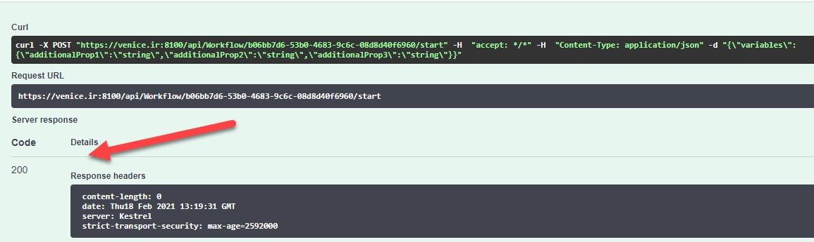

# وب‌سرویس‌های موتور گردش‌کار

این وب‌سرویس‌ها قابل فراخوانی از هر سیستم خارجی می‌باشند که شامل موارد زیر می‌باشند:

- وب‌سرویس‌های گردش کار
- وب‌سرویس‌های اجرای گردش کار
- وب‌‌سرویس‌های سیگنال
- وب‌سرویس‌های فعالیت کاربر
- وب‌سرویس‌های اجرا
- وب‌سرویس‌های خطای اجرا

که هریک مورد بررسی قرار داده می‌شود.

شکل 48: لیست تمامی وب‌سرویس‌های موتور گردش کار

ابتدا گردش کار مورد نظر را از طریق واسط کاربری ایجاد نمایید.

شکل 49: گردش کار ایجاد شده از طریق واسط کاربری

## وب‌سرویس‌های گردش کار

### شروع گردش کار

پس از ایجاد گردش کار، با استفاده از id یا key مربوط به گردش کار می‌توان اجرای جدیدی را از گردش کار را آغاز نمود. برای این کار باید وب‌سرویس شروع گردش کار را از طریق Postman یا Swagger فراخوانی کرد. در این صفحه وب‌سرویس‌های موتور گردش کار قرار داده شده‌اند که با استفاده از id یا key مؤلفه مربوطه، می‌توان آن‌ها را فراخوانی نمود. برای دسترسی به شناسه گردش کار می‌توان در صفحه گردش کار بر روی گردش کار موردنظر کلیک کرده تا اطلاعات گردش کار نمایش داده شود. در تصویر زیر دو وب‌سرویس شروع گردش کار را مشاهده می‌کنید که با استفاده از id یا key گردش کار، می‌توان آن‌ها را فراخوانی کرد.

شکل 50: وب‌سرویس شروع گردش کار

همان‌طور که بیان شد، برای این که بتوان یک اجرا از گردش کار موردنظر را آغاز نمود، باید id یا key گردش کار موردنظر را به وب‌سرویس شروع گردش کار ارسال کنید. برای این کار، کافی است روی وب‌سرویس شروع گردش کار کلیک کرده و در قسمت ظاهر شده، ابتدا بر روی دکمه Try it out کلیک کنید، سپس id گردش کار را در Input قرار داده و دکمه Execute را بزنید تا اجرای گردش کار آغاز شود. بعد از انجام این کار، می‌توان پاسخ وب‌سرویس را مشاهده نمود.

شکل 51: قرار دادن شناسه در وب‌سرویس شروع گردش کار

اگر پاسخ ۲۰۰ دریافت شد، به این معنی است که گردش کار با موفقیت شروع شده است.

شکل 52: پاسخ وب‌سرویس شروع گردش کار

## وب‌سرویس‌های فعالیت کاربر

### دریافت لیست وظایف

با شروع هر گردش کار به محض رسیدن به فعالیت کاربر، آن فعالیت در لیست وظایف قرار خواهد گرفت. از طریق وب‌سرویس زیر می‌توان لیست فعالیت‌هایی که باید انجام گیرد را مشاهده نمود.

شکل 53: وب‌سرویس دریافت لیست وظایف

همان‌طور که در تصویر زیر مشاهده می‌کنید، لیست وظایف جاری تنها شامل یک فعالیت کاربر است.

شکل 54: پاسخ وب‌سرویس دریافت لیست وظایف

### انتساب فعالیت کاربر

از این وب‌سرویس برای انتساب فعالیتی به یک فرد، استفاده می‌شود. به این طریق که شناسه فعالیت موردنظر و نیز شناسه شخص انتساب داده‌شده را برای وب‌سرویس ارسال کنید.

شکل 55: وب‌سرویس انتساب فعالیت

شکل 56: وب‌سرویس تخصیص فعالیت به یک فرد

### تکمیل فعالیت کاربر

برای اینکه یک فعالیت کاربری را به پایان برسانید، باید از وب‌سرویس اتمام فعالیت استفاده کنید. کافی است بر روی وب‌سرویس اتمام فعالیت کلیک کرده و بعد از زدن دکمه Try it out، شناسه فعالیت کاربر را در Input قرار دهید و سپس دکمه Execute را بزنید تا فعالیت جاری به پایان برسد. در بدنه درخواست می‌توان دو مقدار را تعیین کرد:

- فیلد assigneeId که نشان می‌دهد چه شخصی این فعالیت را انجام داده است. لازم به ذکر است اگر در تعریف گردش کار در مدل‌ساز، این فیلد تعیین نشده باشد و وب‌سرویس انتساب نیز (که در زیربخش قبل اشاره شد) جهت تعیین مسئول این فعالیت فراخوانی نشده باشد، مقداردهی این فیلد در وب‌سرویس اتمام فعالیت الزامی نخواهد بود.
- فیلد variables که می‌تواند مقادیر چند متغیر را به صورت JSON ارائه کند. این متغیرها در اجرای گردش کار ذخیره شده و در ادامه آن قابل استفاده خواهند بود.

شکل 57: وب‌سرویس اتمام فعالیت

شکل 58: ارسال شناسه فعالیت در حال اجرا به وب‌سرویس

شکل 59: پاسخ وب‌سرویس اتمام فعالیت

اگر دوباره وب‌سرویس دریافت لیست وظایف را صدا بزنید، خواهید دید که فعالیت جاری، فعالیت دوم این گردش کار است. به‌این‌علت که فعالیت اول گردش کار به پایان رسیده است.

### بازیابی فعالیت

این وب‌سرویس، شناسه فعالیت را دریافت و اطلاعات فعالیت را به عنوان خروجی برمی‌گرداند.

شکل 60: ارسال شناسه فعالیت به وب‌سرویس

شکل 61: پاسخ وب‌سرویس بازیابی فعالیت

## وب‌سرویس‌های اجرای گردش کار

### دریافت نمونه‌های اجرایی یک گردش کار

برای اینکه بتوان نمونه‌های در حال اجرای یک گردش کار مشخص را پیدا کرد، کافی است شناسه گردش کار را برای وب‌سرویس زیر ارسال کنید.

شکل 62: وب‌سرویس دریافت نمونه‌های اجرایی یک گردش کار

شکل 63: قرار دادن شناسه در وب‌سرویس

شکل 64: پاسخ وب‌سرویس دریافت نمونه‌های اجرایی یک گردش کار

## وب‌سرویس‌های سیگنال

### بازیابی تمام سیگنال‌ها

برای بازیابی تمام سیگنالها کافی است بعد از زدن دکمه‌ی Try it out بر روی دکمه‌ی Execute کلیک نمایید.

شکل 65: وب‌سرویس بازیابی تمام سیگنال‌ها

شکل 66: پاسخ وب‌سرویس بازیابی تمام سیگنال‌ها

### افزودن سیگنال

کافی است بر روی دکمه Try it out کلیک کرده و سپس در بدنه‌ی درخواست کلید، عنوان و توصیف سیگنال را درج نمایید.

شکل 67: وب‌سرویس افزودن سیگنال

### بازیابی سیگنال از طریق کلید

برای بازیابی سیگنال موردنظر خود، کافی است کلید را در قسمت مشخص شده درج نمایید و سپس بر روی Execute کلیک نمایید.

شکل 68: وب‌سرویس بازیابی سیگنال با کلید

شکل 69: پاسخ وب‌سرویس بازیابی سیگنال از طریق کلید

### حذف سیگنال

کافی است کلید سیگنال برای وب‌سرویس ارسال شود.

شکل 70: وب‌سرویس حذف سیگنال

### ویرایش سیگنال

برای ویرایش، کافی است ابتدا در قسمت مشخص شده، کلید سیگنال را درج و در بدنه‌ی درخواست مقادیر فعلی را ویرایش نمود.

شکل 71: وب‌سرویس ویرایش سیگنال

## وب‌سرویس‌های اجرا

وب‌سرویس‌های اجرا شامل مواردی همچون بازیابی جزئیات اجرای‌گردش‌کار، توقف نمونه‌ی اجرایی، از سرگیری( ادامه‌ی) اجرای فرایند متوقف شده و لغو نمونه‌ی درحال‌اجرا می‌باشد.

شکل 72: وب‌سرویس‌های اجرا

### بازیابی جزئیات اجرای گردش‌کار

برای اینکه بتوان اطلاعاتی درباره اجرای گردش‌کار موردنظر به دست آورید، کافی‌است شناسه این نمونه‌ی‌اجرایی را برای وب‌سرویس زیر ارسال نمایید.

شکل 73: وب‌سرویس بازیابی جزئیات اجرای گردش کار

در مورد نحوه ارسال شناسه گردش کار اجرایی، مطابق مراحل گفته‌شده در وب‌سرویس اتمام فعالیت عمل کنید.

شکل 74: ارسال شناسه گردش کار اجرایی مورد نظر به وب‌سرویس

شکل 75: پاسخ وب‌سرویس بازیابی جزئیات نمونه گردش کار در حال اجرا

### توقف اجرای گردش‌کار

با استفاده از وب‌سرویس زیر می‌توان نمونه‌ درحال‌اجرا را در وضعیت فعلی خود متوقف کرد. کافی‌است شناسه‌ نمونه‌اجرایی را در قسمت مشخص شده درج کرده و سپس بر روی Execute کلیک نمایید.

شکل 76: وب‌سرویس توقف اجرا

### وب‌سرویس ادامه‌اجرا

درصورتی‌که نمونه‌ی‌اجرایی متوقف شده‌باشد، با استفاده از وب‌سرویس زیر می‌توان اجرای فرایند متوقف‌شده را از مرحله‌ی توقف آغاز نمود. برای این‌کار باید شناسه‌ی فرایند اجرایی را برای وب‌سرویس زیر ارسال نمایید.

شکل 77: وب‌سرویس ادامه‌اجرا

### وب‌سرویس لغو

اگر بخواهید اجرای یک نمونه از گردش‌کاری را لغو نمایید، می‌بایست شناسه‌ی نمونه ‌درحال‌اجرا را برای وب‌سرویس زیر ارسال نمایید.

 شکل 78: وب‌سرویس لغو

## وب‌سرویس‌های خطای اجرا

شکل 79: وب‌سرویس‌های خطای اجرا

### بازیابی جزئیات خطای یک گردش‌کار در حال اجرا

با استفاده از این وب‌سرویس می‌توان جزئیات بیشتری را از خطای گردش‌کار اجرایی دریافت نمود.

شکل 80: درج شناسه خطا و شناسه گردش‌کار اجرایی

شکل 81: پاسخ وب‌سرویس بازیابی جزئیات گردش‌کار اجرایی

### تلاش برای رفع خطای یک گردش‌کار در حال اجرا

با ارسال راه‌حل موردنظر و شناسه گردش‌کار اجرایی و شناسه خطا برای وب‌سرویس زیر می‌توان خطای پیش‌آمده در گردش‌کار در حال اجرا را برطرف نمود.

شکل 82: وب‌سرویس رفع خطای گردش‌کار اجرایی

